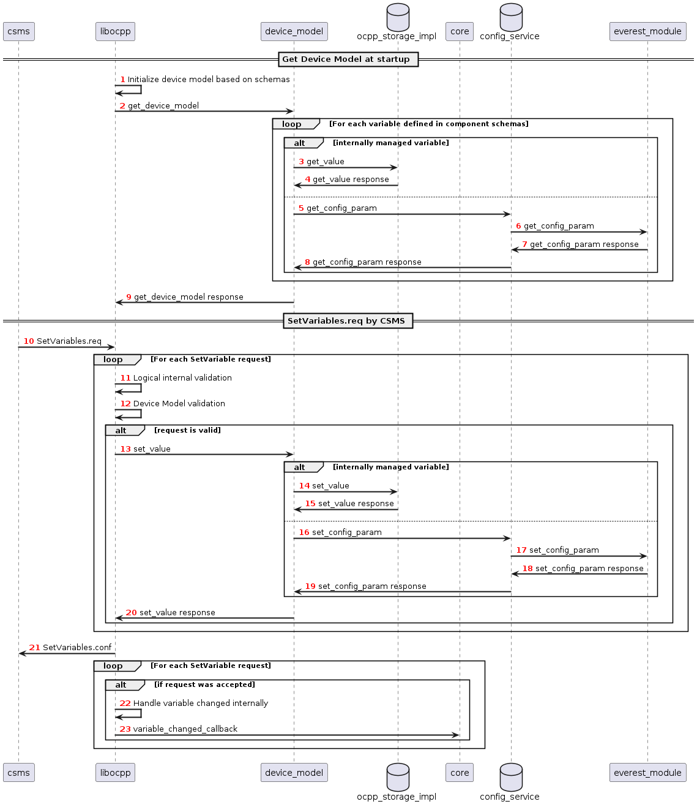
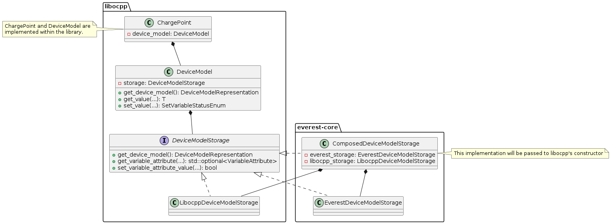

# Config Service in EVerest

This is a WIP design document for a configuration service in EVerest.

## Problem description
* It is currently not possible for EVerest modules to change the configuration parameters of other modules at runtime (only via interface commands)
* Establishing this via interface commands to set these config variables does not scale
* There is no mechanism to persist configuration changes at runtime
* OCPP2.0.1 defines the mutability of configuration parameters and requires config variables to be changed at runtime (by the CSMS)
* OCPP2.0.1 defines data structures for components and variables that are not in line with the current definition in EVerest

## Current solution within EVerest for OCPP2.0.1
* Libocpp defines a device model API
* Libocpp provides an implementation for the device model API but the implementation can also be provided externally
* The device model implementation in libocpp uses SQLite as a persistent storage backend
* The device model implementation parses component schemas and a config to initialize the device model database
* All variables are controlled, accessed and stored by libocpp, even those that configure other EVerest modules (as a current workaround, some interfaces have been extended to allow the change of configuration at runtime) 

## Goal
* Introduce a configuration service in the everest-framework that allows to change and retrieve configuration parameters of EVerest modules at runtime
* Provide access to priviliged modules like OCPP to this config service

## Requirements of the Config Service
* Config refactor --> Modules get their config via MQTT as JSON
* Responsible for read and write operations of configuration parameters of EVerest modules at runtime and startup
* Config service to be accessed by priviliged modules (e.g. OCPP) using an option in the manifest.yaml like `enable_config_service`
* Config service needs to notify priviliged modules (e.g. OCPP) if a variable has changed (e.g. internally or by some other module/UI etc.)
* Config handler shall be part of modules with R/W config parameters (extend ev-cli module generation for this)
* Module config parameter definition needs to be extended by mutability option (RW, RO, WO) in manifest.yaml 

This is how the config_service may be used within priviliged modules:

```c++
this->config_service->set_config_param(module_id, optional<implementation_name>, config_name, value);
```

This is how modules may use the config service to change their internal configuration themselves:

```c++
this->conifg.set_param(config_name, value)
```

### Internally and Externally Managed Variables of the Device Model

As mentioned in the introduction the device model of OCPP2.0.1 can contain various physical or logical components and variables. While in OCPP1.6 almost all of the standardized configuration keys are used to influence the control flow of libocpp, in OCPP2.0.1 the configuration and telemtry variables that can be part of the device model go beyond the control or reporting capabilities of only libocpp. Still there is a large share of standardized variables in OCPP2.0.1 that do influence the control flow of libocpp. Therefore it is requirement to make a distinction between externally and internally managed variables of the device model inside the device model implementation:
* Internally managed variables: Internally managed variables influence the control flow or can be reported by libocpp and are therefore owned by libocpp. If the mutability of such a variable is ReadWrite, the CSMS or the consumer of libocpp can set its value and the OCPP201 module is responsible for updating this value in the device model. 
  Examples: HeartbeatInterval, AuthorizeRemoteStart, SampledDataTxEndedMeasurands, AuthCacheStorage
* Externally managed variables: These variables do not influence the control flow of libocpp
  Examples: ConnectionTimeout, MasterPassGroupId

## Requirements for OCPP201 module
* Provide external implementation of device model API
* Implement `device_model_storage.hpp` as part of OCPP201 module
* Device model implementation must differntiate between internally and externally managed variables
  * Internally Managed: Owned, stored and accessed by OCPP201 module in device model storage (implementation in libocpp can be used)
  * Externally Managed: Owned, stored and accessed via EVerest config service
  * For externally managed variables a mapping to the EVerest configuration parameter needs to be defined
* Add property for internally or externally managed to each variable in the component schemas
* This design allows for singe source of truth --> OCPP is source for internally managed variables and config service for externally managed configuration variables
* Allow definition of externally managed variables in component schemas and add mechanism to identify them --> All variables and components are still defined by the schemas
* Only internally managed variables can be configured by OCPP schemas/config. 
* Add mapping mechanism from component schema variables to EVerest config paramaters and vice versa

## Sequence of variable access for internally and externally managed variables



## Class Diagram for Device Model

The following class diagram describes the dependencies between libocpp and everest-core and its interfaces and implementations.



Clarification of the device model classes of this diagram:
* DeviceModel: 
  * Part of libocpp
  * Contains device model representation and business logic to prevalidate requests to the storage
  * Contains reference to device model storage implementation
* DeviceModelStorage:
  * Pure virtual class of libocpp
  * Defines contract for storage implementations
* LibocppDeviceModelStorage
  * Implements DeviceModelStorage as part of libocpp
  * Represents existing SQLite implementation of device model
* EverestDeviceModelStorage
  * Implements DeviceModelStorage as part of everest-core (OCPP201 module)
  * Uses config service to interact with EVerest modules
* ComposedDeviceModelStorage
  * (Final) implementation of DeviceModelStorage as part of everest-core (OCPP201 module)
  * A reference of this class will be passed to libocpp's ChargePoint constructor
  * Differentiates between externally and internally managed variables

## Next steps to adjust OCPP2.0.1 and libocpp

* Keep libocpp untouched. Optionaly: Rename `DeviceModelStorage` class to `DeviceModelInterface`
* Create a skeleton for the `ComposedDeviceModelStorage` class (implements the `DeviceModelInterface`) inside the OCPP201 module
  * Create the skeleton for the `EverestDeviceModelStorage` class that implements the `DeviceModelInterface`
  * Keep the `EverestDeviceModelStorage` empty for now / return defaults
  * Make the `LibocppDeviceModelStorage` and `EverestDeviceModelStorage` fields of the `ComposedDeviceModelStorage`
  * Add placeholders for internally and externally managed differentation within implementation of `ComposedDeviceModelStorage`
  * For now only make use of the `LibocppDeviceModelStorage` inside the `ComposedDeviceModelStorage`
  * Pass the `ComposedDeviceModelStorage` to the v201::ChargePoint constructor
  * Goal: Device Model should behave exactly as it does currently, we have only added the skeleton to extend this 
