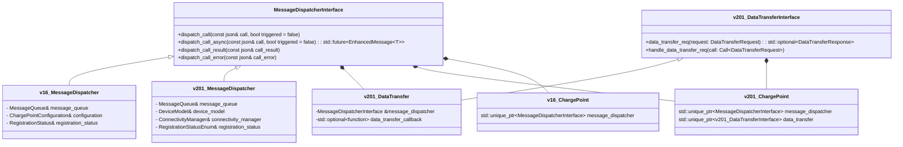

# Message Dispatching Class Diagram

```mermaid
classDiagram
class MessageDispatcherInterface {
    +dispatch_call(const json& call, bool triggered = false)
    +dispatch_call_async(const json& call, bool triggered = false): std::future~EnhancedMessage~T~~
    +dispatch_call_result(const json& call_result)
    +dispatch_call_error(const json& call_error)
}

class v16_MessageDispatcher {
    - MessageQueue& message_queue
    - ChargePointConfiguration& configuration
    - RegistrationStatus& registration_status
}

class v201_MessageDispatcher {
    - MessageQueue& message_queue
    - DeviceModel& device_model
    - ConnectivityManager& connectivity_manager
    - RegistrationStatusEnum& registration_status
}

class v201_DataTransferInterface {
    +data_transfer_req(request: DataTransferRequest): std::optional~DataTransferResponse~
    +handle_data_transfer_req(call: Call~DataTransferRequest~)
}

class v201_DataTransfer {
    -MessageDispatcherInterface &message_dispatcher
    -std::optional~function~ data_transfer_callback
}

class v201_ChargePoint {
    std::unique_ptr~MessageDispatcherInterface~ message_dispatcher
    std::unique_ptr~v201_DataTransferInterface~ data_transfer
}

class v16_ChargePoint {
    std::unique_ptr~MessageDispatcherInterface~ message_dispatcher
}

MessageDispatcherInterface <|-- v16_MessageDispatcher  
MessageDispatcherInterface <|-- v201_MessageDispatcher
v201_DataTransferInterface <|-- v201_DataTransfer
MessageDispatcherInterface *-- v201_DataTransfer
MessageDispatcherInterface *-- v201_ChargePoint
v201_DataTransferInterface *-- v201_ChargePoint
MessageDispatcherInterface *-- v16_ChargePoint
```
