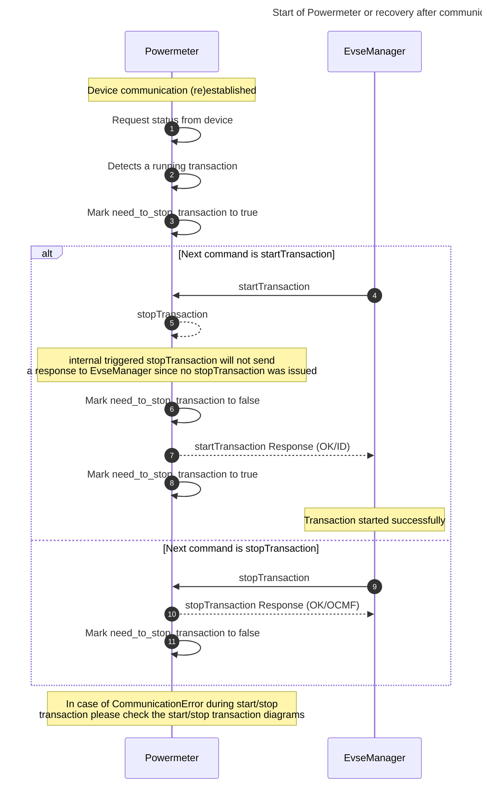

```mermaid
sequenceDiagram
autonumber
participant Powermeter
participant EvseManager

title Start of Powermeter or recovery after communication loss

Note over Powermeter: Device communication (re)established

Powermeter->>Powermeter: Request status from device
Powermeter->>Powermeter: Detects a running transaction
Powermeter->>Powermeter: Mark need_to_stop_transaction to true

alt Next command is startTransaction
    EvseManager->>Powermeter: startTransaction
    Powermeter-->>Powermeter: stopTransaction
    Note over Powermeter: internal triggered stopTransaction will not send <br>a response to EvseManager since no stopTransaction was issued
    Powermeter->>Powermeter: Mark need_to_stop_transaction to false
    Powermeter-->>EvseManager: startTransaction Response (OK/ID)
    Powermeter->>Powermeter: Mark need_to_stop_transaction to true

    Note over EvseManager: Transaction started successfully

else Next command is stopTransaction
    EvseManager->>Powermeter: stopTransaction
    Powermeter-->>EvseManager: stopTransaction Response (OK/OCMF)
    Powermeter->>Powermeter: Mark need_to_stop_transaction to false
end

Note over Powermeter: In case of CommunicationError during start/stop<br> transaction please check the start/stop transaction diagrams
```