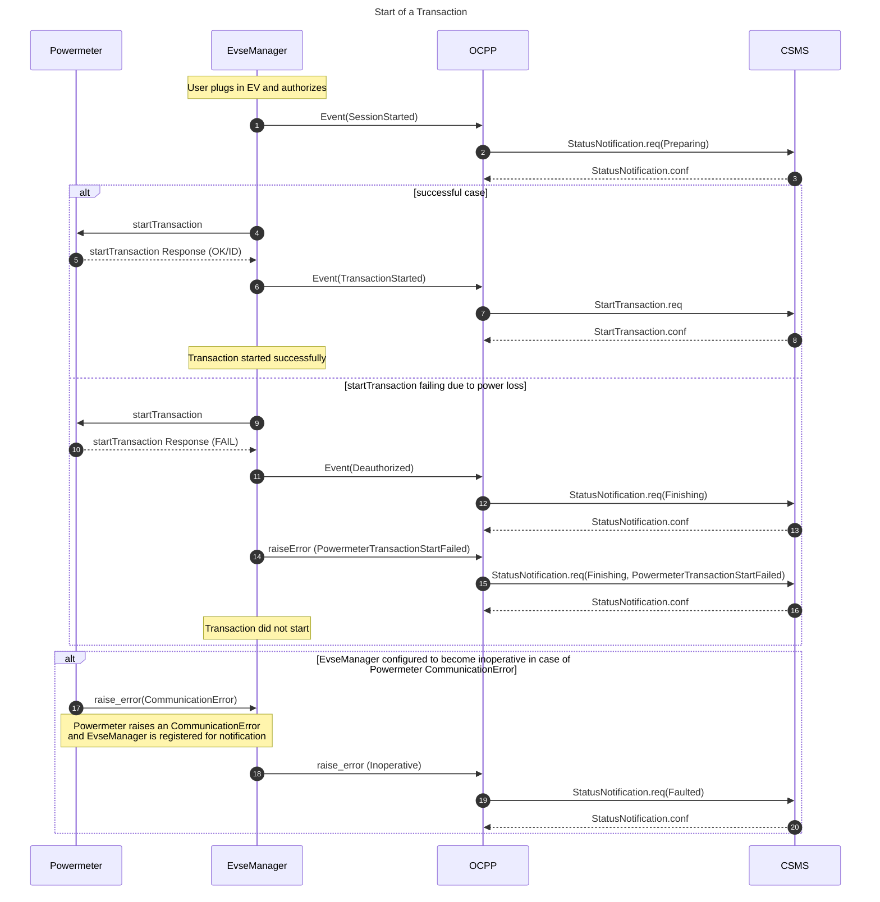

```mermaid
sequenceDiagram
autonumber
participant Powermeter
participant EvseManager
participant OCPP
participant CSMS

title Start of a Transaction

Note over EvseManager: User plugs in EV and authorizes

EvseManager->>OCPP: Event(SessionStarted)

OCPP->>CSMS: StatusNotification.req(Preparing)
CSMS-->>OCPP: StatusNotification.conf

alt successful case
    EvseManager->>Powermeter: startTransaction
    Powermeter-->>EvseManager: startTransaction Response (OK/ID)

    EvseManager->>OCPP: Event(TransactionStarted)
    OCPP->>CSMS: StartTransaction.req
    CSMS-->>OCPP: StartTransaction.conf

    Note over EvseManager: Transaction started successfully

else startTransaction failing due to power loss
    EvseManager->>Powermeter: startTransaction
    Powermeter-->>EvseManager: startTransaction Response (FAIL)

    EvseManager->>OCPP: Event(Deauthorized)

    OCPP->>CSMS: StatusNotification.req(Finishing)
    CSMS-->>OCPP: StatusNotification.conf

    EvseManager->>OCPP: raiseError (PowermeterTransactionStartFailed)
    OCPP->>CSMS: StatusNotification.req(Finishing, PowermeterTransactionStartFailed)
    CSMS-->>OCPP: StatusNotification.conf

    Note over EvseManager: Transaction did not start
end

alt EvseManager configured to become inoperative in case of Powermeter CommunicationError
    Powermeter->>EvseManager: raise_error(CommunicationError)
    Note over Powermeter,EvseManager: Powermeter raises an CommunicationError <br/>and EvseManager is registered for notification
    EvseManager->>OCPP: raise_error (Inoperative)
    OCPP->>CSMS: StatusNotification.req(Faulted)
    CSMS-->>OCPP: StatusNotification.conf
end

```