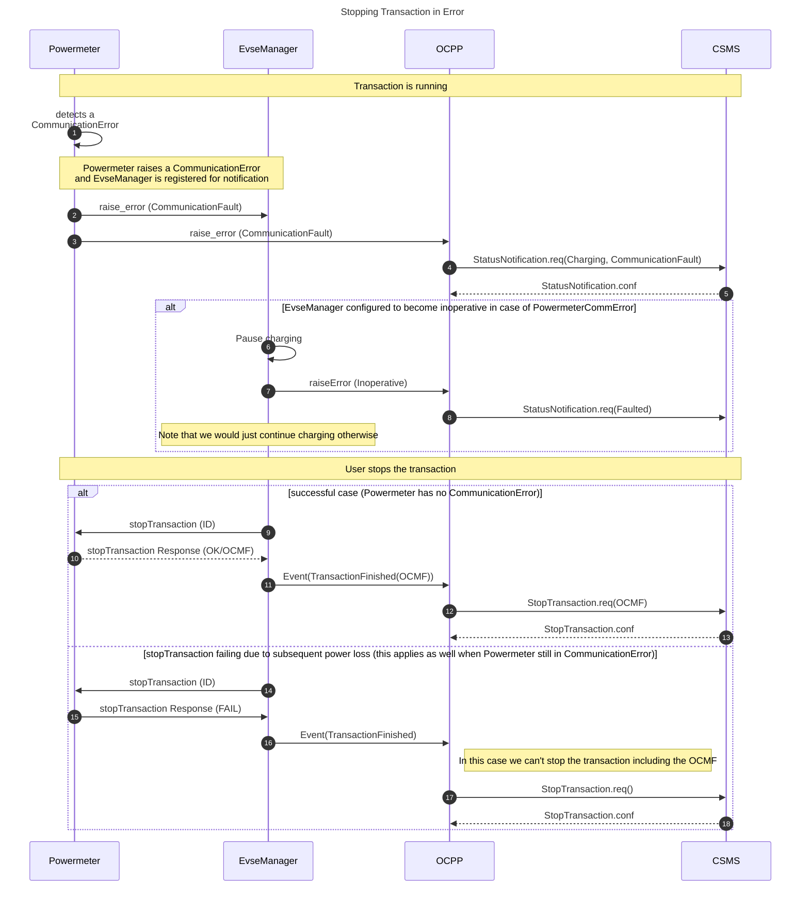

```mermaid
sequenceDiagram
autonumber
participant Powermeter
participant EvseManager
participant OCPP
participant CSMS

title Stopping Transaction in Error

Note over Powermeter, CSMS: Transaction is running

Powermeter->>Powermeter: detects a <br/> CommunicationError
Note over Powermeter,EvseManager: Powermeter raises a CommunicationError <br/>and EvseManager is registered for notification
Powermeter->>EvseManager: raise_error (CommunicationFault)
Powermeter->>OCPP: raise_error (CommunicationFault)

OCPP->>CSMS: StatusNotification.req(Charging, CommunicationFault)
CSMS-->>OCPP: StatusNotification.conf

alt EvseManager configured to become inoperative in case of PowermeterCommError
    EvseManager->>EvseManager: Pause charging
    EvseManager->>OCPP: raiseError (Inoperative)
    OCPP->>CSMS: StatusNotification.req(Faulted)
    Note over EvseManager: Note that we would just continue charging otherwise
end

Note over Powermeter, CSMS: User stops the transaction

alt successful case (Powermeter has no CommunicationError)
    EvseManager->>Powermeter: stopTransaction (ID)
    Powermeter-->>EvseManager: stopTransaction Response (OK/OCMF)
    EvseManager->>OCPP: Event(TransactionFinished(OCMF))

    OCPP->>CSMS: StopTransaction.req(OCMF)
    CSMS-->>OCPP: StopTransaction.conf
else stopTransaction failing due to subsequent power loss (this applies as well when Powermeter still in CommunicationError)
    EvseManager->>Powermeter: stopTransaction (ID)
    Powermeter->>EvseManager: stopTransaction Response (FAIL)
    EvseManager->>OCPP: Event(TransactionFinished)

    Note right of OCPP: In this case we can't stop the transaction including the OCMF
    OCPP->>CSMS: StopTransaction.req()
    CSMS-->>OCPP: StopTransaction.conf
end
```