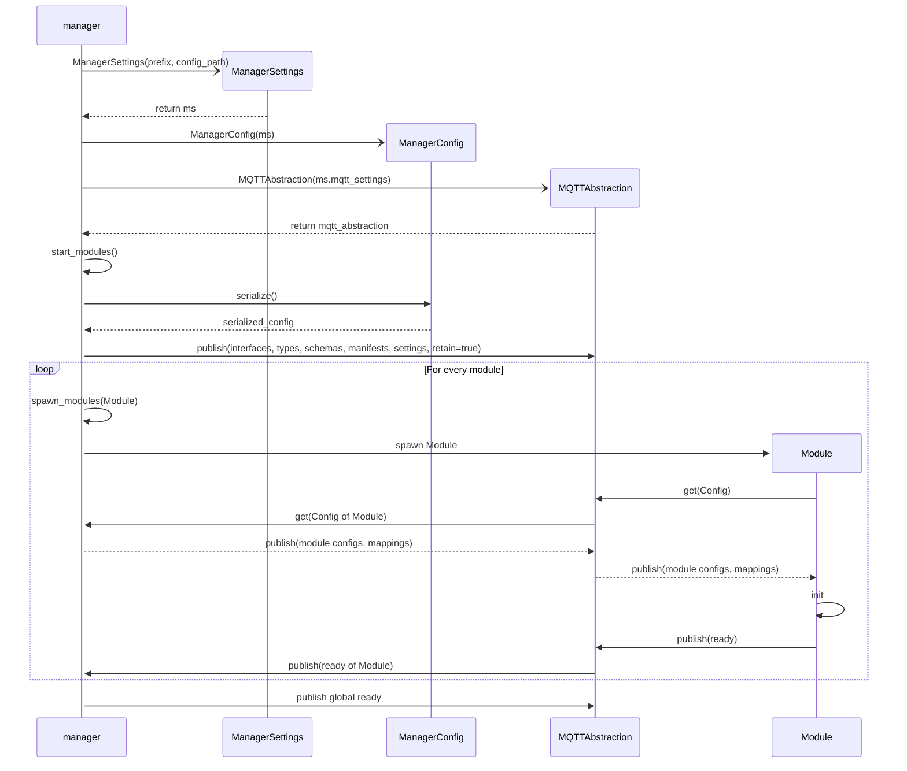
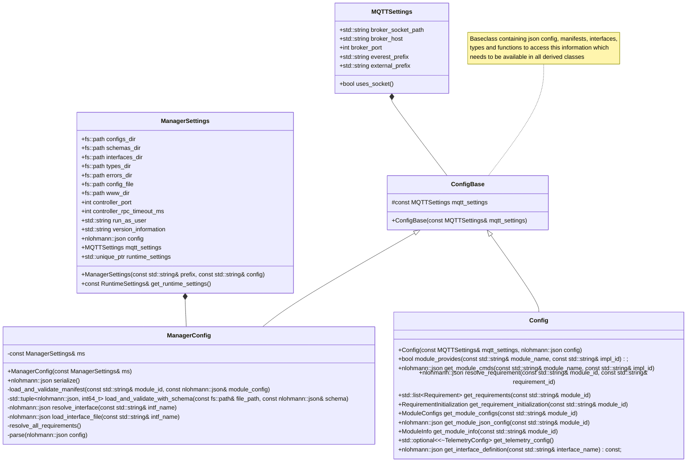

# Module configuration distributed via MQTT

Since everest-framework 0.19.0 the module configuration is parsed once
by the manager and then distributed to the modules via MQTT.
This is achieved by parsing the MQTT settings from the config,
spawning the modules and passing these MQTT settings to them.
The modules themselves then ask for their module config via MQTT,
which is in turn provided to them from the manager.
After the modules have received their config, their init() function is called.
Afterwards they signal ready to the manager.
The manager sends out the global ready signal
once it has received all Module ready signals.

The following sequence diagram illustrates this startup process

Class diagram

