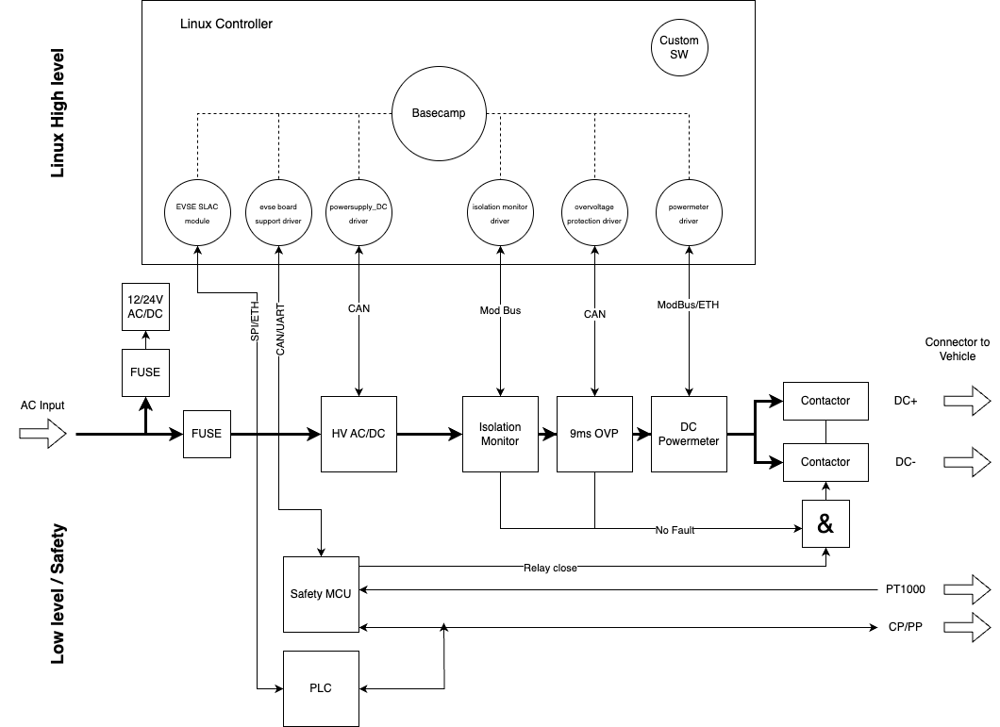
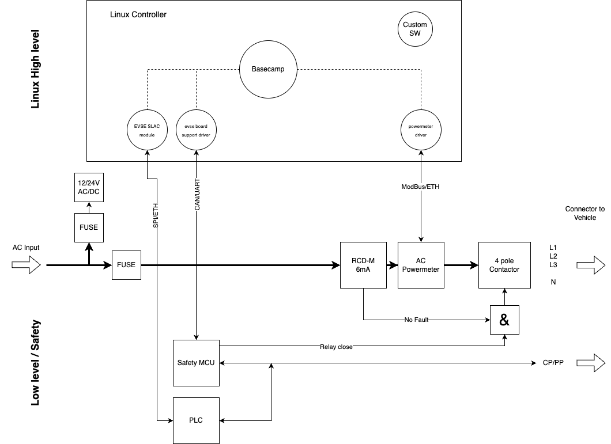

#####################
Hardware Architecture
#####################

This page gives some ideas and guidance on the general architecture of AC or DC
charging stations and helps to choose the best components.

***************
DC architecture
***************

The following block diagram shows a typical architecture for a DC charger:

On the top, the Linux high-level controller runs EVerest plus all customer
specific software.
EVerest connects to the hardware components through the EVerest-integrated
hardware drivers or external custom drivers that use the EVerest APIs to
communicate with EVerest.

The hardware components are typically connected to the Linux controller by
CAN, RS458, Ethernet or similar.
They may be different in your design.

On the bottom, a typical low-level controller design is shown.
Handling the electrical safety in the low-level design is crucial, as the
high-level Linux controller cannot guarantee timings or even that it is running
at all.

The safety MCU shall handle at least the following functionality:

* Control pilot signal I/O:
  It outputs the PWM according to the duty cycle controlled by EVerest and reads
  states A-F back.

* Contactor close signal:
  It receives an “on/off” flag from EVerest and also internally creates a second
  “on/off” flag.
  As an example, the internal flag is only “on” if e.g. CP is in state C and no
  overtemperature is detected with the PT1000 on the connector pins.
  It outputs a contactor close signal only if both flags are “on”.
  It is responsible for opening the output contactors in case of CP state not C,
  over-temperature errors, loss of PE connection and all other critical
  faults - independent from the Linux high-level control.

* The isolation monitor and the over-voltage protection circuitry shall also be
  able to directly open the output contactors, independent of other components.
  This fault signal may also be routed through the safety MCU.
  EVerest will read values from the isolation monitor and the OVP module as well
  and will issue a shutdown, but this will come (1) too late and (2) the safety
  shutdowns shall be working even if Linux is down.

The safety MCU may require certification for e.g. UL as it contains safety in
software functionality.

The output contactors should be the last component before the plug to the EV.
Then they fully disconnect the user from all internal circuitry, so as long as
the contactors are open, no internal fault causes a safety hazard on the output
plug pins.

The block diagram above shows only two output contactors to fully switch the
output on and off.
Some power supplies may require a third contactor that switches a precharge
resistor in the output path.
This is required if the DC power supply does not have an accurate and fast
current limit functionality at very low limits (e.g. 1A).

If the DC power supply cannot ramp down the voltage quickly, an additional
contactor may be required that switches a load resistor on the output for
active discharge.

Both are not shown here as they are typically not required with most EV
charging power supplies.

***************
AC architecture
***************

The typical architecture for an AC charger is similar to that of a DC
charger, but has fewer components on the power path. The requirements for the
safety MCU apply here as well.

************************
Choosing components (AC)
************************

Output contactors
=================

The output contactors shall have a mirror feedback contact.
With many DIN rail components, the mirror contact (or auxiliary contact) can be
mounted as a snap on device.
Ensure that the minimum current requirements are met.
Some contactors require between 10 mA and 50 mA of current flowing through the
mirror contact to ensure the contacts remain clean.

Especially for PCB mount contactors, check the contact air gap.
It should be at least 3 mm (check IEC 61851-1:2017 8.1 for alternatives).
The 3 mm found in the IEC 61851-1 originates from IEC 60664-1 Table F.2 for
4 kV rated impulse voltage, overvoltage category 3, inhomogeneous field.
For a homogeneous field, 1.2 mm would be enough.

In general, a 4-pole contactor should be used.
Some applications (such as solar-based charging) may want to use two 2-pole
contactors to allow for 1 ph/3 ph switching.
See the chapter on RCD below on limitations when using this configuration.

A significant part of the generated heat comes from the coil current.
It is recommended to lower the coil voltage as per specifications from the
manufacturer after the switching.

Examples for PCB mount 4-pole relays:
Panasonic AHER4191, Omron G9KC.

RCD
===

Integration of an RCD is optional; but if it is not in the charging station it
has to be installed in the upstream installation outside of the charging
station.
RCDs shall comply with one of the following standards:
IEC 61008-1, IEC 61009-1, IEC 60947-2 and IEC 62423.

For AC charging, a type B RCD is generally required to protect against both
AC and DC fault currents.

The RCD Type B may also be integrated into the charging station, simplifying
the installation requirements.

As Type B RCDs are quite expensive, a common solution is to integrate a
Type A RCD for AC faults and a DC fault current detector as a separate module.

In this case, the 6 mA DC fault detection module should follow IEC 62955
(check IEC 61851-1:2017 8.5; the standard says the IEC 62955 is an example to
be compliant).

Such modules are available as PCB mount or as individual modules, e.g. from
Bender/Vacuumschmelze (Benvac), Würth Elektronik, Western automation and
several others.

.. note::

  The fault output of these modules shall directly open the output contactor
  without waiting for Linux and EVerest.
  EVerest should be informed after the switching off so that the error can be
  reported.

If the general output contactor is used for RCD switch off, IEC 62955 requires
a 4-pole relay.
E.g., two 2-pole relays are no longer allowed by this standard.
In this configuration a combination of two 2-pole contactors for 1 ph/3 ph
switching followed by a 4-pole relay for RCD switch off may be required.

Power meter
===========

For AC applications, a lot of different DIN rail components are available from
many different manufacturers.
Typically, they have a ModBus RS-485 interface to the host.
Most of them can be easily added to EVerest by simple register mapping in the
GenericPowerMeter module if not supported already.

Make sure they are MID-compliant for CE.

If German Eichrecht is required, it is a bit harder to find power meters.
They are available from Bauer or EMH, for example.

TODO: Choosing components (DC) and choosing components (AC and DC)