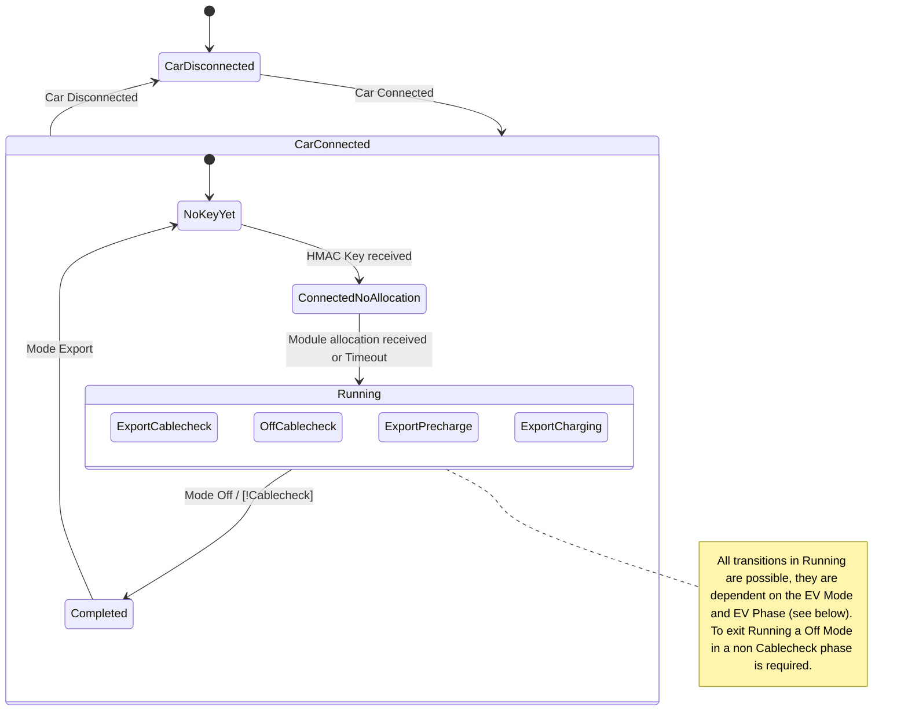

# Fusion Charger Dispenser Lib

A Library that provides a high-level interface for the Huawei Fusion-Charge Power-Suply Unit

## Create virtual ethernet interface

```bash
sudo ip link add veth0 type veth peer name veth1
sudo ip link set dev veth0 up
sudo ip link set dev veth1 up
```

### Delete again
```bash
sudo ip link delete veth0
```

## FSM

Developed during the workshops



### Detailed States

#### CarDisconnected

The car is not connected to the charger, we send stop goose frames and report an **Standby** working state

#### NoKeyYet

The car is now connected to the charger but we don't have a hmac key yet. We set the working state to **StandbyWithConnectorInserted** which will trigger a hmac key generation on the PSU (which we receive via modbus). We still send stop goose frames.

#### ConnectedNoAllocation

After we receive the hmac key via modbus we send placeholder requests to the PSU. To do that we have to be in the **ChargingStarting** working state. If we don't receive a response from the PSU in time we will still go to the Running state (as the goose answer frame might just have been dropped and we will not know that). If we receive a response we go to the Running state.

#### Running

We now have successfully allocated a module on the PSU and have a HMAC key thus we can start charging!

Initially we still send placeholder requests to the PSU and are in the ChargingStarting working State.

After a while everest will report some other Mode and phase. Depending on the mode and phase we go to different working states (see below).

When we receive an Off without being in the Cablecheck phase we go to the Completed state.

#### Completed

We are done charging and ready to charge again. If the car disconnects we go back to CarDisconnected; if we receive another Export mode we go back to NoKeyYet and acquire a new key and module placeholder allocation

### Workingstates

| State (siehe oben)    | EV Mode | EV Phase   | Working state                |
| --------------------- | ------- | ---------- | ---------------------------- |
| CarDisconnected       | *       | *          | Standby                      |
| NoKeyYet              | *       | *          | StandbyWithConnectorInserted |
| ConnectedNoAllocation | *       | *          | ChargingStarting             |
| Running               | Off     | *          | ChargingStarting             |
| Running               | Export  | Cablecheck | ChargingStarting             |
| Running               | Export  | Precharge  | ChargingStarting             |
| Running               | Export  | Charge     | Charging                     |
| Completed             | *       | *          | ChargingCompleted            |

### Goose Frames

| State (siehe oben)    | EV Mode | EV Phase       | Goose type       | Goose PowerRequirement type              |
| --------------------- | ------- | -------------- | ---------------- | ---------------------------------------- |
| CarDisconnected       | *       | *              | Stop             |                                          |
| NoKeyYet              | *       | *              | Stop             |                                          |
| ConnectedNoAllocation | *       | *              | PowerRequirement | ModulePlaceholderRequest                 |
| Running               | Off     | * (low weight) | PowerRequirement | ModulePlaceholderRequest                 |
| Running               | Export  | Cablecheck     | PowerRequirement | InsulationDetectionVoltageOutput         |
| Running               | Off     | Cablecheck     | PowerRequirement | InsulationDetectionVoltageOutputStoppage |
| Running               | Export  | Precharge      | PowerRequirement | Precharge                                |
| Running               | Export  | Charge         | PowerRequirement | RequirementDuringCharging                |
| Completed             | *       | *              | Stop             |                                          |


### Connection State

| State(siehe oben) | ConnectionState |
| ----------------- | --------------- |
| CarDisconnected   | NOT_CONNECTED   |
| *                 | FULLY_CONNECTED |

### Charge Event

- Transition to Running: STOP_TO_START
- Transition to Completed: START_TO_STOP

### Module Placeholder Allocation failed

When we get the response from the PSU that the module placeholder allocation failed we go to Running thus we store a flag whether the module placeholder allocation was successful or not.

This flag is reset when we go out of the Running state.

# Note on State Behavior

The state is divided into two "substates"

## Substate Init
- `Init`: Start state; Establishes Modbus connection and waits for the PSU's MAC address; possibly Goose spawned thread(s)
- `OK`: Init was successful
- `Failed`: Init was unsuccessful -> error state

If the Modbus heartbeat fails, we go back and attempt an `init` again. This may repeat indefinitely.

## Substate PowerRequestStatus
**This status is only relevant if the init state is `OK`!**

- `Stop`: Start state; When a car connects, transition to `init`
- `Init`: Waits for HMAC from the PSU; If received, send a placeholder request via Goose. Depending on the response, it is either `ready` (positive response) or `failed` (negative response or timeout; check Goose for timeouts)
- `Ready`: The car is loading and Goose frames are happily pushed back and forth; transitions to `Stop` when loading is complete (=> deletes the HMAC, as it is no longer used).
- `Failed`: Remains in this state until the car is disconnected. Then transitions to `Stop` (=> deletes the HMAC).

=> How to handle it if the car is back in the Start state but is already connected? Can this happen?
