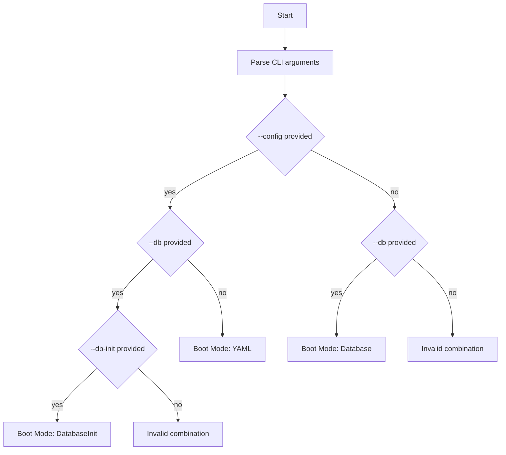

# EVerest Boot Mode Application Logic

The `manager` process retrieves the EVerest configuration, manages module dependencies and communication, and starts EVerest modules as individual processes.

The EVerest configuration can be provided via a YAML file, an SQLite database, or both. This section explains how EVerest starts up depending on the CLI options used:

- `--config`: Full path to the EVerest YAML configuration file.
- `--db`: Full path to the EVerest SQLite configuration database.
- `--db-init`: Indicates that the specified config should be used to initialize the database if it does not exist or does not contain a valid configuration.

Based on these options, there are three possible boot modes:

- **YAML Boot Mode**: The configuration is loaded from a YAML file. This mode is used when only the `--config` argument is provided.
- **Database Boot Mode**: The configuration is loaded from an SQLite database. This mode is used when only the `--db` argument is provided.
- **DatabaseInit Boot Mode**: The configuration is preferably loaded from an SQLite database. If the database does not exist or does not contain a valid EVerest configuration, the YAML file specified by `--config` is used instead, and the configuration is then written to the database. This mode requires all three options: `--config`, `--db`, and `--db-init`. In a subsequent start of the application, the database can be used to retrieve
the configuration.

## Boot Mode Application Logic Flow Chart

