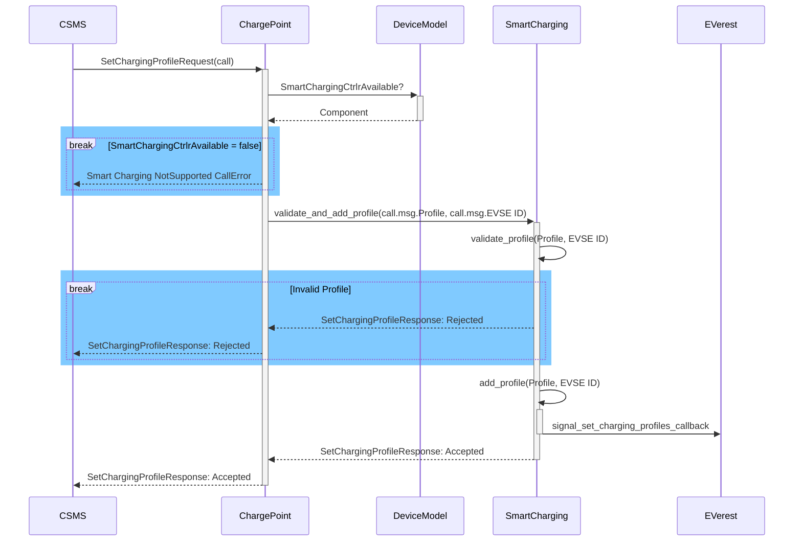
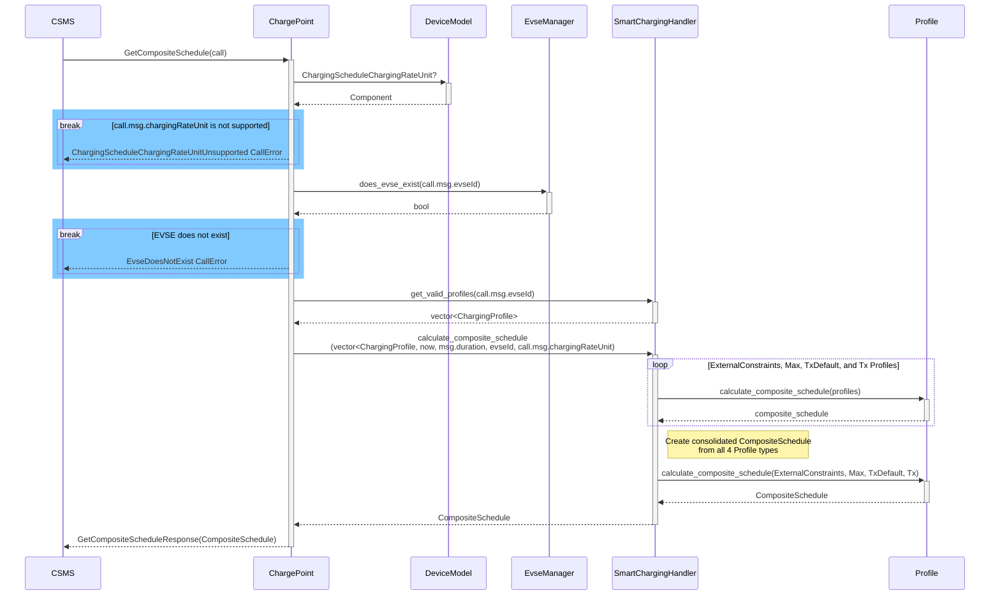
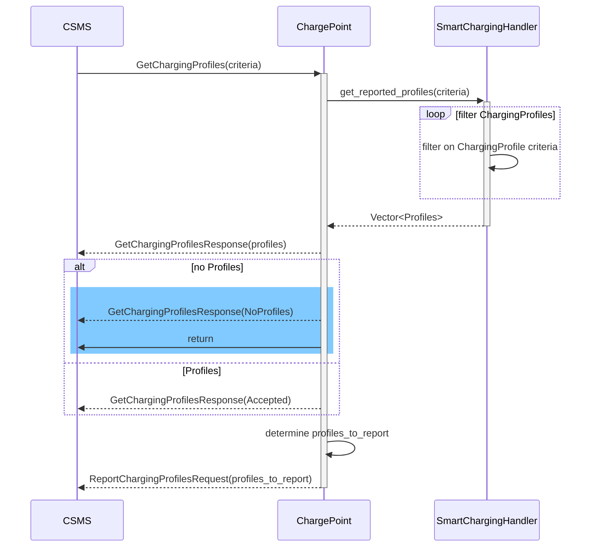
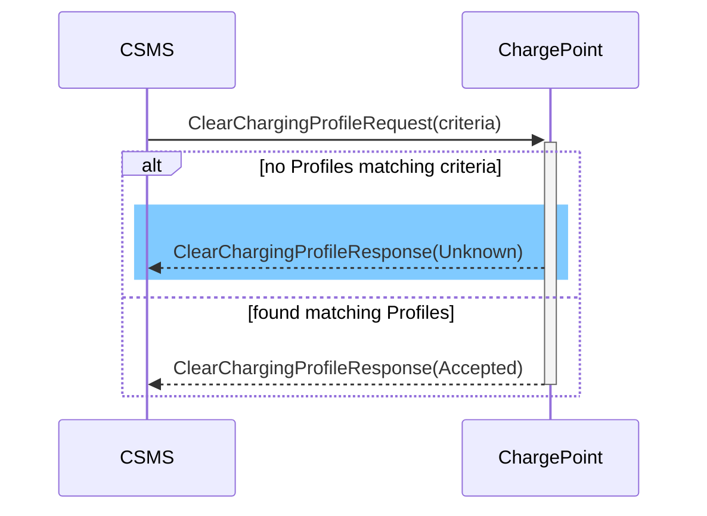
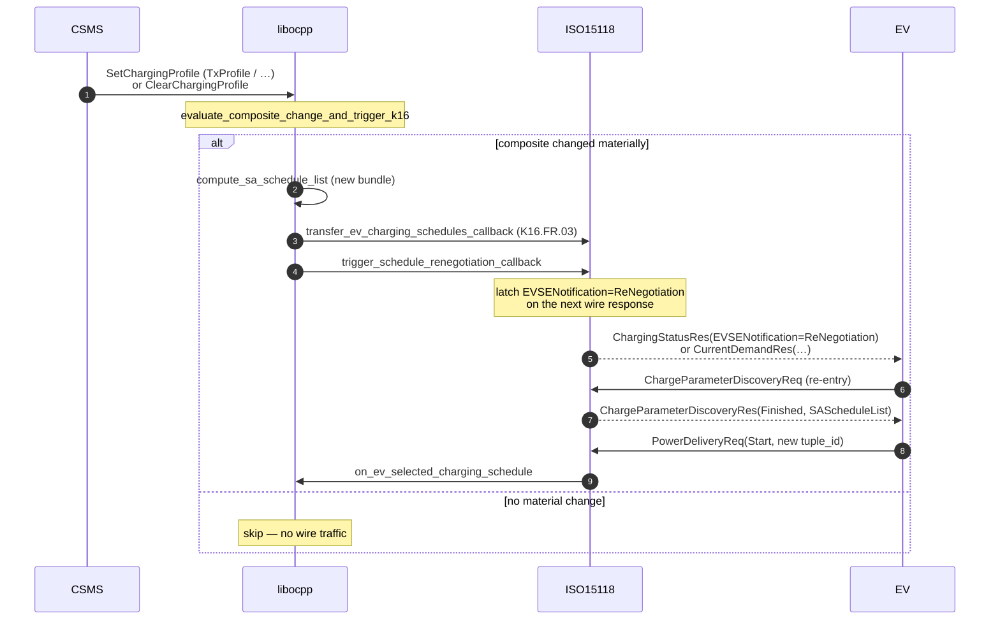
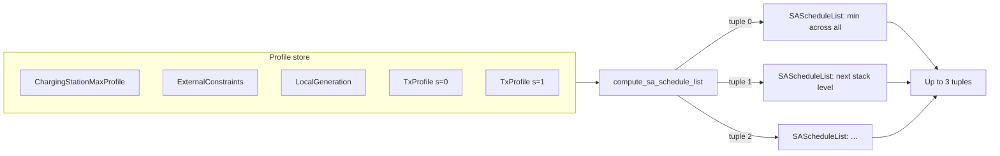

# Smart Charging Use Cases

The use cases within the Smart Charging functional block are subdivided into the following three categories of use cases:

1. General Smart Charging (Use Cases K01–K10)
2. External Charging Limit-based Smart Charging (K11–K14)
3. ISO 15118-based Smart Charging (K15–K17)

Support for General, External Charging Limit-based, and ISO 15118-based Smart Charging is implemented. K15 (initial schedule handoff over HLC) and K16 (schedule renegotiation) are covered on ISO 15118-2; ISO 15118-20 support for K18/K19 is a passthrough/state-store today and awaits an upstream `libiso15118` session mutator. For an up-to-date overview of exactly which features are currently supported as well as design decisions that have been made to address optional or ambiguous functional requirements, please refer to the [OCPP 2.0.1 Status document](ocpp_2x_status.md).

## K01 SetChargingProfile

Allows the CSMS to influence the charging power or current drawn from a specific EVSE or the
entire Charging Station over a period of time.



Profile validation returns the following errors to the caller when a Profile
is `Rejected`:

| Errors                                                        | Description                                                                                                                                                                                                                                         |
| :------------------------------------------------------------ | :-------------------------------------------------------------- |
| `ChargingProfileFirstStartScheduleIsNotZero`                  | The `startPeriod` of the first `chargingSchedulePeriod` needs to be 0.<br>[K01.FR.31] |
| `ChargingProfileNoChargingSchedulePeriods`                    | Happens when the `ChargingProfile` doesn't have any Charging Schedule Periods. |
| `ChargingScheduleChargingRateUnitUnsupported`                 | Happens when a chargingRateUnit is passed in that is not configured in the `ChargingScheduleChargingRateUnit`. [K01.FR.26] |
| `ChargingSchedulePeriodInvalidPhaseToUse`                     | Happens when an invalid `phaseToUse` is passed in. [K01.FR.19] [K01.FR.48] |
| `ChargingSchedulePeriodPhaseToUseACPhaseSwitchingUnsupported` | Happens when `phaseToUse` is passed in and the EVSE does not have `ACPhaseSwitchingSupported` defined and set to true. [K01.FR.20] [K01.FR.48] |
| `ChargingSchedulePeriodsOutOfOrder`                           | `ChargingSchedulePeriod.startPeriod` elements need to be in increasing values. [K01.FR.35] |
| `ChargingStationMaxProfileCannotBeRelative`                   | Happens when a `ChargingStationMaxProfile.chargingProfileKind` is set to `Relative`. [K01.FR.38] |
| `ChargingStationMaxProfileEvseIdGreaterThanZero`              | Happens when a `ChargingStationMaxProfile` is attempted to be set with an EvseID isn't `0`. [K01.FR.03] |
| `ChargingProfileMissingRequiredStartSchedule`                 | Happens when an `Absolute` or `Recurring` `ChargingProfile` doesn't have a `startSchedule`. [K01.FR.40] |
| `ChargingProfileExtraneousStartSchedule`                      | Happens when a Relative `ChargingProfile` has a `startSchedule`. [K01.FR.41] |
| `EvseDoesNotExist`                                            | Happens when the `evseId`of a `SetChargingProfileRequest` does not exist. [K01.FR.28] |
| `ExistingChargingStationExternalConstraints`                  | Happens when a `SetChargingProfileRequest` Profile has a purpose of `ChargingStationExternalConstraints` and one already exists with the same `ChargingProfile.id` exists. [K01.FR.05] |
| `InvalidProfileType`                                          | Happens when a `ChargingStationMaxProfile` is attempted to be set with a `ChargingProfile` that isn't a `ChargingStationMaxProfile`. |
| `TxProfileEvseHasNoActiveTransaction`                         | Happens when a `SetChargingProfileRequest` with a `TxProfile` is submitted and there is no transaction active on the specified EVSE. [K01.FR.09] |
| `TxProfileEvseIdNotGreaterThanZero`                           | `TxProfile` needs to have an `evseId` greater than 0. [K01.FR.16] |
| `TxProfileMissingTransactionId`                               | A `transactionId` is required for`SetChargingProfileRequest`s with a `TxProfile` in order to match the profile to a specific transation. [K01.FR.03] |
| `TxProfileTransactionNotOnEvse`                               | Happens when the provided `transactionId` is not known. [K01.FR.33] |
| `TxProfileConflictingStackLevel`                              | Happens when a `TxProfile` has a `stackLevel` and `transactionId` combination already exists in a `TxProfile` with a different id in order to ensure that no two charging profiles with same stack level and purpose can be valid at the same time. [K01.FR.39] |

## K08 Get Composite Schedule

The CSMS requests the Charging Station to report the Composite Charging
Schedule, as calculated by the Charging Station for a specific point of
time, and may change over time due to external causes such as local
balancing based on grid connection capacity and EVSE availablity.

The Composite Schedule is the result of result of merging the time periods
set in the `ChargingStationMaxProfile`, `ChargingStationExternalConstraints`,
`TxDefaultProfile` and `TxProfile` type profiles.



## K09 Get Charging Profiles

Returns to the CSMS the Charging Schedules/limits installed on a Charging Station based on the 
passed in criteria.



## K10 Clear Charging Profile

Clears Charging Profiles installed on a Charging Station based on the
passed in criteria.



## K15 ISO 15118 Smart Charging: initial handoff

Over ISO 15118 the CSMS composite charging schedule is not delivered to
the EV via an external-limits value; the EV must receive it inside the
ISO 15118 handshake (as `SAScheduleList` on ISO 15118-2 or
`ScheduleExchangeRes` on ISO 15118-20). K15 is the use case that wires
a libocpp-computed schedule bundle to the ISO 15118 stack so the EV can
select a tuple and start charging under those limits.

### Integration surface

The integration layer registers three callbacks on `ChargePoint` and
calls one event handler per HLC step. None of the hooks is mandatory;
omitting them cleanly downgrades the station to non-HLC smart charging.

| Surface | When it fires | Who implements |
|---|---|---|
| `notify_ev_charging_needs_response_callback` | After libocpp decides to accept (or defer) the EV's `NotifyEVChargingNeedsRequest`. Carries a `NotifyEVChargingNeedsStatusEnum` (`Accepted` / `Rejected` / `Processing` / …). The ISO 15118 stack uses this to stop replying `EVSEProcessing=Ongoing` and to know whether to wait for the bundle or synthesize a fallback. | OCPP201 module → `iso15118_extensions` command `set_hlc_schedule_wait(bool)` |
| `transfer_ev_charging_schedules_callback` | After libocpp's composite builder has emitted the `SAScheduleList` tuples. Carries `evse_id`, a vector of `ChargingSchedule`s (≤3), per-tuple signature payloads (ISO 15118-20 V2G20-2637 signing), and optionally the id of the schedule the CSMS prefers. | OCPP201 module → `iso15118_extensions` command `set_ev_charging_schedules` |
| `trigger_schedule_renegotiation_callback` | After libocpp recomputes the composite and observes that it differs materially from the last handoff (K16). Carries `evse_id`. | OCPP201 module → `iso15118_extensions` command `trigger_schedule_renegotiation` |
| **Event handler** `on_ev_charging_needs(NotifyEVChargingNeedsRequest)` | The ISO 15118 stack has received `ChargeParameterDiscoveryReq` (15118-2) or `ServiceSelectionReq` (15118-20) and wants libocpp to decide + build the bundle. | ISO 15118 stack → OCPP201 → libocpp |
| **Event handler** `on_ev_selected_charging_schedule(evse_id, sa_schedule_tuple_id, selected_charging_schedule_id, ev_charging_schedule)` | The EV has picked a tuple (via `PowerDeliveryReq` on 15118-2 or the equivalent 15118-20 state) and optionally returned its own schedule. libocpp uses this to run the K15.FR.09 boundary check and to build `NotifyEVChargingSchedule`. | ISO 15118 stack → OCPP201 → libocpp |

### Happy path (ISO 15118-2)

```mermaid
sequenceDiagram
    autonumber
    CSMS->>libocpp : SetChargingProfile (TxProfile)
    Note over libocpp : composite is cached; no HLC session yet

    EV->>ISO15118 : ChargeParameterDiscoveryReq
    ISO15118->>libocpp : on_ev_charging_needs(request)
    ISO15118-->>EV : ChargeParameterDiscoveryRes(EVSEProcessing=Ongoing)

    Note over libocpp : compute_sa_schedule_list<br/>(K15.FR.22 composite)
    libocpp->>ISO15118 : notify_ev_charging_needs_response_callback(Accepted)
    Note over ISO15118 : set_hlc_schedule_wait(true)<br/>arms the CPD handoff deadline

    libocpp->>ISO15118 : transfer_ev_charging_schedules_callback(bundle)
    Note over ISO15118 : store bundle; release the CPD gate

    EV->>ISO15118 : ChargeParameterDiscoveryReq (retry)
    ISO15118-->>EV : ChargeParameterDiscoveryRes(Finished, SAScheduleList)

    EV->>ISO15118 : PowerDeliveryReq(Start, tuple_id)
    ISO15118->>libocpp : on_ev_selected_charging_schedule
    Note over libocpp : K15.FR.09 boundary check;<br/>build NotifyEVChargingSchedule
    libocpp->>CSMS : NotifyEVChargingSchedule
```

### Key steps and the functional requirements they satisfy

- **1–3** `on_ev_charging_needs` carries the EV's energy requirements forward; the `NotifyEVChargingNeedsRequest` is later forwarded to the CSMS. **[K15.FR.01]**
- **4** `compute_sa_schedule_list` combines `ChargingStationMaxProfile`, `ChargingStationExternalConstraints`, `LocalGeneration`, and up to three stacked `TxProfile`s into a composite that respects the station and tenant caps. `salesTariff` is preserved from the highest-stack-level contributing TxProfile per slot. **[K15.FR.04, FR.07, FR.08, FR.22]**
- **5–6** The ISO 15118 stack receives `set_hlc_schedule_wait(true)` and arms a deadline (see `EvseV2G.cpd_timeout_ms`, default 60 s). If the deadline elapses before the bundle arrives, the stack synthesizes a conservative fallback tuple and releases the CPD gate. **[K15.FR.03]**
- **7** Delivery. libocpp hands off up to three `SAScheduleList` tuples keyed by `evse_id`. **[K15.FR.05]**
- **8–9** The EV retries `ChargeParameterDiscoveryReq`, the stack replies `Finished` with the tuples, the EV selects one.
- **10–12** `on_ev_selected_charging_schedule` runs the boundary check (see next section) and fires `NotifyEVChargingSchedule` upstream. **[K15.FR.21]**

### K15.FR.09 boundary check

Fires on every `on_ev_selected_charging_schedule` when the EV returns its own `ChargingSchedule` (optional on 15118-2, required on 15118-20). `verify_ev_profile_within_boundaries` (in `smart_charging.cpp`) compares each period of the EV schedule against the CSMS composite at the same instant:

- Same chargingRateUnit → direct compare.
- Unit mismatch or sign flip (charge vs discharge envelope) → immediate renegotiation.
- **Magnitude-aware**: for negative (discharge) envelopes, `|ev_limit| <= |csms_limit|` is in bounds; a plain `>` compare would accept `-20 A` inside a `-10 A` envelope and reject `-5 A` inside a `-16 A` envelope.

If the EV profile is out of bounds, libocpp fires `trigger_schedule_renegotiation_callback` and the flow continues as **K16** from the EV side. **[K15.FR.09, K16.FR.04]**

### K15.FR.17 cancellation / empty-schedule fallback

If the EV does not select a tuple (e.g. because the CSMS has no active profile and libocpp delivered no tuples), the stack falls back to an unlimited schedule. libocpp still emits `NotifyEVChargingSchedule` with a synthesized placeholder period so the message passes the CSMS schema's `minItems=1` constraint on `chargingSchedulePeriod`. **[K15.FR.17, K15.FR.19]**

## K16 Schedule Renegotiation (CSMS-driven)

When the CSMS installs or clears a profile mid-session, the composite may change. K16 observes the change and drives the EV back into `ChargeParameterDiscovery` so it sees the new tuples.

### Trigger surface (K16.FR.02)

Every `SetChargingProfile` and `ClearChargingProfile` whose purpose could alter the composite re-enters the decision:

- `TxProfile` / `TxDefaultProfile`
- `ChargingStationMaxProfile`
- `ChargingStationExternalConstraints`
- `LocalGeneration`
- `ClearChargingProfile` matching any of the above

`evaluate_composite_change_and_trigger_k16` in `smart_charging.cpp` recomputes the composite for the session's EVSE and compares it to `last_handed_off_schedules` (the cached bundle). If the two differ materially (slot-by-slot limit, unit, or phase count change; tuple add/remove), the trigger fires. Purely-cosmetic updates (same bundle, different order) do not fire.

### Flow



### Why re-delivery is mandatory (K16.FR.03)

Without step 3, the ISO 15118 stack would re-enter CPD and serve the *stale* bundle from the previous handoff. `transfer_ev_charging_schedules_callback` is re-invoked before the trigger so the stack has the new bundle cached and ready to serve on the EV's next `ChargeParameterDiscoveryReq`. The callback itself is idempotent.

### EVSE envelope on renegotiation (K16.FR.11)

On ISO 15118-2 the envelope is announced in two places:

- `ChargingStatusRes` (AC) / `CurrentDemandRes` (DC) — dynamic; already tracked `EnergyManager` limit.
- `AC_EVSEChargeParameter.EVSEMaxCurrent` inside `ChargeParameterDiscoveryRes` (AC, served on re-entry) — this is a static snapshot and on renegotiation re-entry it must advertise `min(hardware_nominal, dynamic_limit)` rather than the hardware nominal. Otherwise the EV sees a higher envelope on CPD re-entry than on the following `ChargingStatusRes` and the renegotiation is effectively a no-op.

ISO 15118-20 K16.FR.11 is deferred: `libiso15118` d20 has no session mutator yet, so `Evse15118D20` logs a warning when the trigger fires.

## Composite SA schedule builder (K15.FR.22)

`compute_sa_schedule_list` (in `smart_charging.cpp`) is called every time a bundle must be produced: initial K15 handoff, K16 re-delivery, and internally for the K15.FR.09 boundary check.

### Inputs

- `DeviceModel` — to resolve `ChargingScheduleChargingRateUnit` and K15.FR.22 tunables.
- `ocpp_version` — for 2.0.1 vs 2.1 behavior divergence (LocalGeneration is 2.1-only).
- `evse_id` — the EVSE the tuples are for.
- `session_start` — anchor for `Relative` and `Recurring` profile kinds.
- The live `ChargingProfile` store.

### Composition rules

For each time slot t in the planning window:

1. Collect the single active profile per purpose-and-stack-level (the highest stack level wins within a purpose, per K01).
2. Union the active slots across `ChargingStationMaxProfile`, `ChargingStationExternalConstraints`, `LocalGeneration`, and every stacked `TxProfile`.
3. The composite limit for slot t is `min(limit across all contributing profiles)` — lowest-limit-wins (K08.FR.04).
4. The composite `salesTariff` is taken from the highest-stack-level contributing `TxProfile` at slot t (other profile types do not carry tariffs).

### Output

Up to three `SAScheduleList` tuples, ordered by stack level (lowest level first). The caller picks `selected_charging_schedule_id` if it has a preference; libocpp defaults to the first tuple.


