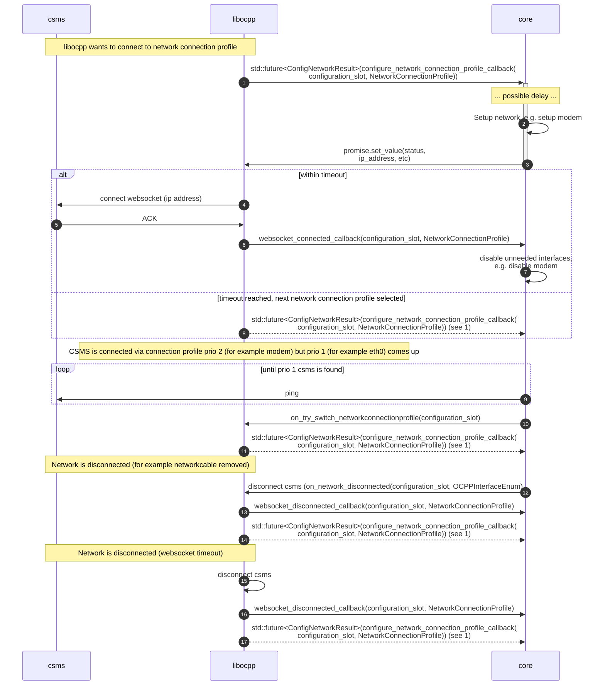

# Network connection profile interface

libocpp automatically tries to connect using the given network connection profiles.
However, if you want more control, you can use the callbacks provided for the network connection.

libocpp will automatically connect to the network profile with the highest priority.
If this fails, it will network profile with the second highest priority, and so on.

## Set up interface (optional)

A callback can be implemented to set up the interface. For example, if the interface is a modem, it must first be
be activated before it is possible to connect to this interface. To do this, you can implement the callback
`std::future<ConfigNetworkResult>(configure_network_connection_profile_callback(configuration_slot, NetworkConnectionProfile))`

In the implementation of this callback, you have to create a promise and return the future to the promise:
```cpp
std::promise<ocpp::v2::ConfigNetworkResult> promise();
std::future<ocpp::v2::ConfigNetworkResult> future = promise.get_future();
return future;
```

If the network was setup successfully, you can set the values in the promise with
```cpp
promise.set_value(configNetworkResult);
```
This way, libocpp knows that it can connect to the given interface and will try to do so.
A timeout can be configured using `NetworkConfigTimeout' to wait longer or shorter than the default 60 seconds.

### Bind to a specific interface

In some cases there are multiple network interfaces available and you may want to connect to a specific one.
In `ConfigNetworkResult` you can specify which interface you want the websocket to bind to.
Sometimes an interface has more than one IP address (in the case of a local/auto link for example).
In this case you want the websocket to bind to a specific IP address. The `interface_address` in ConfigNetworkResult supports both.
It will bind to the given network interface (a string containing the name of the interface) or the given ip address (a string containing the ip address in human readable format).

## Connect to higher network connection profile priority (optional)

Normally, when libocpp is connected with a network connection profile, it will not disconnect.
However, there may be a situation where libocpp is connected to a profile with priority 2 or lower, and you find out at system level that an interface (with a higher priority) has changed and is now up.
A call is added so that you can suggest that libocpp switch to this profile: `bool on_try_switch_network_connection_profile(const int32_t configuration_slot)`.
libocpp will inform the caller by the return value if it tries to switch to this profile.

## Disconnected / connected callbacks

libocpp provides two callbacks for when the websocket is connected and disconnected. It will provide the network slot
in these callbacks, so you can keep the network connection in use (e.g. not disable the modem), or disable the network connection (example again: disable the modem).

## Sequence diagram

'core' can be read as any application that implements libocpp

For step 9, ping is one way to check if a CSMS is up, but you of course can implement a way to check this yourself.


