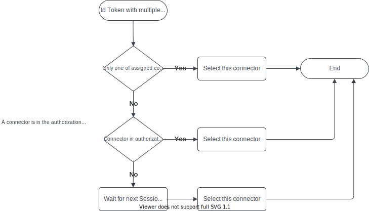

# Auth Module

This module handles incoming authorization and reservation requests.

The task of the module is to receive tokens from token providers, validate them and assign them to EvseManagers. It is responsible to provide authorization to EvseManagers and to stop transactions at the EvseManagers if a token or parent id token is presented to stop a transaction. In addition, the module is responsible for managing all reservations and matching them with incoming tokens.

The module contains the logic to select a connector for incoming tokens (e.g. by waiting for a car plug in, user interface, random selection, etc.). Currently one selection algorithm is implemented and described in [Selection Algorithm](#selection-algorithm)

The following flow diagram describes how an incoming token is handled by the module.

## Integration in EVerest

This module provides implementation for the reservation and the auth interface.

It requires connections to module(s) implementing the token_provider, token_validator and evse_manager interfaces.

The following diagram shows how it integrates with other EVerest modules.

## Selection Algorithm
The selection algorithm contains the logic to select one connector for an incoming token. The algorithm can be specified within the module conifg using the key `selection_algorithm`. 

Currently only the `PlugEvents` is implemented. Handling for `User Input` will be implemented soon.

The following flow chart describes how a connector is selected using the `PlugEvents` algorithm.

