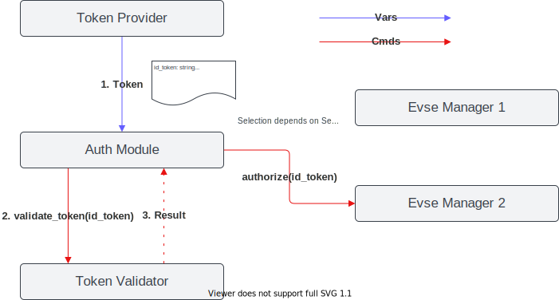

.. _everest_modules_handwritten_Auth:

===========
Auth Module
===========

This module handles incoming authorization and reservation requests.

The task of the module is to receive tokens from token providers, validate them and assign them to EvseManagers.
It is responsible for providing authorization to EvseManagers and for stopping transactions at the EvseManagers if a token
or parent id token is presented to stop a transaction. In addition, the module is responsible for managing all
reservations and matching them with incoming tokens.

The module contains the logic to select a connector for incoming tokens (e.g. by waiting for a car plug in, user
interface, random selection, etc.). Currently two selection algorithms are implemented and described in 
`Selection Algorithm`_.

The following flow diagram describes how an incoming token is handled by the module.

.. image:: token_handling.drawio.svg
   :alt: TokenHandling

.. note::
    
    The processing of each authorization request and the respective validation runs in an individual thread. This 
    allows the parallel processing of authorization requests.

Integration in EVerest
======================

This module provides implementations for the `reservation` and the `auth` interfaces.

It requires connections to module(s) implementing the `token_provider`, `token_validator` and `evse_manager` interfaces.

The following diagram shows how it integrates with other EVerest modules.

Selection Algorithm
===================

The selection algorithm contains the logic to select one connector for an incoming token. The algorithm can be
specified within the module config using the key `selection_algorithm`. In case the charging station has only 
one connector, the selection of a connector is pretty straight-forward because there is only one that is 
available. The selection algorithm becomes relevant in case the Auth module manages authorization requests 
for multiple connectors. 

Three options for the selection are available: 

* PlugEvents
* FindFirst
* UserInput

PlugEvents
----------

The following flow chart describes how a connector is selected using the `PlugEvents` algorithm.

.. image:: plug_events_selection_algorithm.drawio.svg
   :alt: SelectionAlgorithm

.. note::
    
    In case a user authorizes first and no EV is connected to the charger to initiate a SessionStarted event the 
    processing thread waits for a SessionStarted event to select the respective connector. A Plug-In timeout may 
    occur, which will require a subsequent initiation of authorization to start a charging session.

FindFirst
---------

The `FindFirst` selection method simply selects the first available connector that has no active transaction.
This method attempts to select a connector immediately.

UserInput
---------

Not yet implemented.

Plug&Charge Authorization
=========================

Please see the `Plug&Charge configuration guide <https://everest.github.io/nightly/general/07_configure_plug_and_charge.html>`_ 
for further information about the Plug&Charge integration in EVerest.
