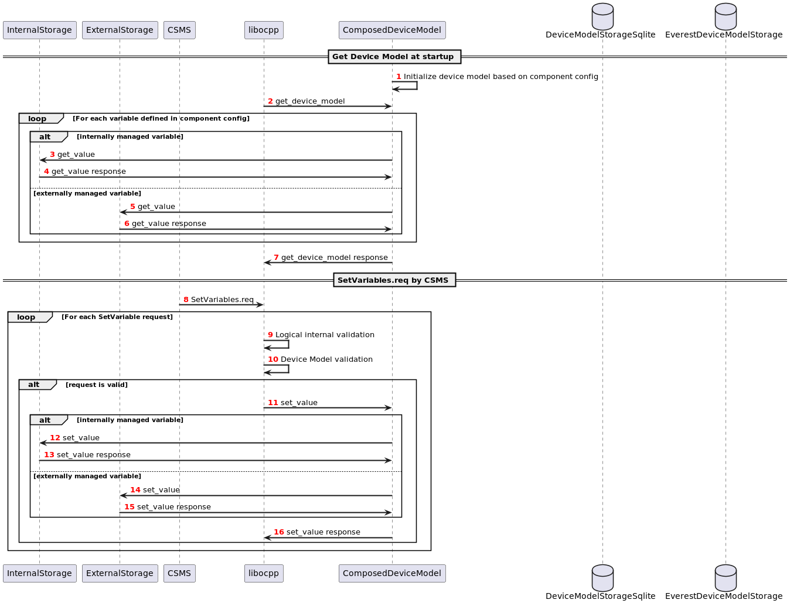
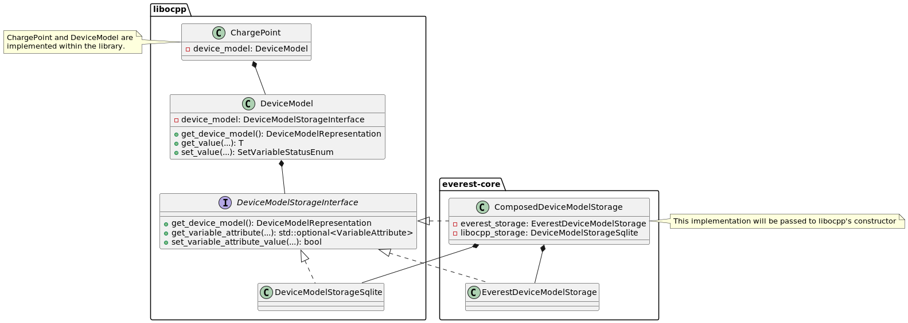

.. _everest_modules_handwritten_OCPP201:

OCPP 2.1 and 2.0.1 Module
================

This module implements and integrates OCPP 2.0.1 and OCPP 2.1 within EVerest. A connection to a Charging Station Management System (CSMS) can be
established by loading this module as part of the EVerest configuration. This module leverages `libocpp <https://github.com/EVerest/libocpp>`_,
EVerest's OCPP library.

The EVerest config `config-sil-ocpp201.yaml <../../config/config-sil-ocpp201.yaml>`_ serves as an example for how to add the OCPP201 module
to your EVerest config.

📌 **Note:**: This module can be used for OCPP2.0.1 and OCPP2.1 communication. The module name OCPP201 is kept for now to allow backwards 
compatability with existing EVerest configurations. It will likely be renamed in the future. The following descriptions apply for both
OCPP2.0.1 and OCPP2.1, referred by using the term **OCPP2**.

Module configuration
--------------------

Like for every EVerest module, the configuration parameters are defined as part of the module `manifest <../manifest.yaml>`_. OCPP2 defines
a device model structure and a lot of standardized variables that are used within the functional requirements of the protocol. Please see 
Part 1 - Architecture & Topology of the OCPP2.0.1 or OCPP2.1 specification for further information about the device model and how it is composed.

For this module, the device model is configured separately in a JSON format. This module initializes the device model based on the configuration
parameter **DeviceModelConfigPath**. It shall point to the directory where the component configuration files are located in two subdirectories:

* standardized
* custom

The `device model setup from libocpp <https://github.com/EVerest/libocpp/tree/main/config/v2/component_config>`_ serves as a good example. 
The split between the directories only has semantic reasons. The **standardized** directory usually does not need to be modified since it contains
standardized components and variables that the specification refers to in its functional requirements. The **custom** directory is meant to be used
for components that are custom for your specific charging station. Especially the number of EVSE and Connector components, as well as their
variables and values, need to be in line with the physical setup of the charging station.

Each device model component is represented by a JSON component config file. This config specifies the component and all its variables,
characteristics, attributes, and monitors. Please see `the documentation for the device model initialization 
<https://github.com/EVerest/libocpp/blob/main/doc/v2/ocpp_201_device_model_initialization.md>`_ for further information on how it is set up.

To add a custom component, you can simply add another JSON configuration file for it, and it will automatically be applied and reported.

Configuring the OCPP2 version
-----------------------------

This module supports OCPP2.0.1 and OCPP2.1. The charging station and the CSMS agree on the protocol version to be used during the websocket
handshake. The charging station indicates which versions it supports in the Sec-WebSocket-Protocol header. This header is set based on 
the device model configuration **SupportedOcppVersions** of the **InternalCtrlr**. The CSMS then selects the version to use and reports
it in the handshake response. Note that **SupportedOcppVersions** is a comma seperated list and allows you to specify the versions
in the order of preference.

Integration in EVerest
----------------------

This module leverages **libocpp** `<https://github.com/EVerest/libocpp>`_, EVerest's OCPP library. Libocpp's approach to implementing the OCPP
protocol is to do as much work as possible as part of the library. It therefore fulfills a large amount of protocol requirements internally.
OCPP is a protocol that affects, controls, and monitors many areas of a charging station's operation though. It is therefore required to 
integrate libocpp with other parts of EVerest. This integration is done by this module and will be explained in this section.

For a detailed description of libocpp and its functionalities, please refer to `its documentation <https://github.com/EVerest/libocpp>`_.

The `manifest <../manifest.yaml>`_ of this module defines requirements and implementations of EVerest interfaces to integrate the OCPP communication
with other parts of EVerest. In order to describe how the responsibilities for functions and operations required by OCPP are divided between libocpp
and this module, the following sections pick up the requirements of this module and implementations one by one.

Provides: auth_validator
^^^^^^^^^^^^^^^^^^^^^^^^

**Interface**: `auth_token_validator <../../interfaces/auth_token_validator.yaml>`_

This interface is implemented to forward authorization requests from EVerest to libocpp. Libocpp contains the business logic to either validate the
authorization request locally using the authorization cache and local authorization list or to forward the request to the CSMS using an 
**Authorize.req**. The implementation also covers the validation of Plug&Charge authorization requests.

Provides: auth_provider
^^^^^^^^^^^^^^^^^^^^^^^

**Interface**: `auth_token_provider <../../interfaces/auth_token_provider.yaml>`_

This interface is implemented to publish authorization requests from the CSMS within EVerest. An authorization request from the CSMS is implemented
by a **RequestStartTransaction.req**.

Provides: data_transfer
^^^^^^^^^^^^^^^^^^^^^^^

**Interface**: `ocpp_data_transfer <../../interfaces/ocpp_data_transfer.yaml>`_

This interface is implemented to provide a command to initiate a **DataTransfer.req** from the charging station to the CSMS.

Provides: ocpp_generic
^^^^^^^^^^^^^^^^^^^^^^

**Interface**: `ocpp <../../interfaces/ocpp.yaml>`_

This interface is implemented to provide an API to control an OCPP service and to set and get OCPP-specific data.

Provides: session_cost
^^^^^^^^^^^^^^^^^^^^^^

**Interface**: `session_cost <../../interfaces/session_cost.yaml>`_

This interface is implemented to publish session costs received by the CSMS as part of the California Pricing whitepaper extension.

Requires: evse_manager
^^^^^^^^^^^^^^^^^^^^^^

**Interface**: `evse_manager <../../interfaces/evse_manager.yaml>`_

Typically the `EvseManager <../EvseManager/>`_ module is used to fulfill this requirement.

This module requires (1-128) implementations of this interface in order to integrate with the charge control logic of EVerest. One connection represents
one EVSE. In order to manage multiple EVSEs via one OCPP connection, multiple connections need to be configured in the EVerest config file.

This module makes use of the following commands of this interface:

* **get_evse** to get the EVSE id of the module implementing the **evse_manager** interface at startup
* **pause_charging** to pause charging in case a **TransactionEvent.conf** indicates charging shall be paused
* **stop_transaction** to stop a transaction in case the CSMS stops a transaction by e.g. a **RequestStopTransaction.req**
* **force_unlock** to force the unlock of a connector in case the CSMS sends a **UnlockConnector.req**
* **enable_disable** to set the EVSE to operative or inoperative, e.g. in case the CSMS sends a **ChangeAvailability.req**. This command can be called from
  different sources. It therefore contains an argument **priority** in order to override the status if required. OCPP2 uses a priority of 5000, which is
  mid-range.
* **set_external_limits** to apply power or ampere limits at the EVSE received by the CSMS using the SmartCharging feature profile. Libocpp contains the
  business logic to calculate the composite schedule for received charging profiles. This module gets notified in case charging profiles are added,
  changed, or cleared. When notified, this module requests the composite schedule from libocpp and publishes the result via the
  `Provides: ocpp_generic <#provides-ocpp_generic>`_ interface. The duration of the composite schedule can be configured by the configuration parameter
  **PublishChargingScheduleDurationS** of this module. The configuration parameter **PublishChargingScheduleIntervalS** defines the interval to use to 
  periodically retrieve and publish the composite schedules. The configuration parameter **RequestCompositeScheduleUnit** can be used to specify the unit in
  which composite schedules are requested and shared within EVerest.

The interface is used to receive the following variables:

* **powermeter** to push powermeter values of an EVSE. Libocpp initiates **MeterValues.req** and **TransactionEvent.req** for meter values internally and is
  responsible for complying with the configured intervals and measurands for clock-aligned and sampled meter values.   
* **ev_info** to obtain the state of charge (SoC) of an EV. If present, this is reported as part of a **MeterValues.req**
* **limits** to obtain the current offered to the EV. If present, this is reported as part of a **MeterValues.req**
* **session_event** to trigger **StatusNotification.req** and **TransactionEvent.req** based on the reported event. This signal drives the state machine and
  the transaction handling of libocpp.
* **waiting_for_external_ready** to obtain the information that a module implementing this interface is waiting for an external ready signal
* **ready** to obtain a ready signal from a module implementing this interface

Requires: connector_zero_sink
^^^^^^^^^^^^^^^^^^^^^^^^^^^^^

**Interface**: `external_energy_limits <../../interfaces/external_energy_limits.yaml>`_

Typically the `EnergyNode <../EnergyNode/>`_ module is used to fulfill this requirement.

This module optionally requires the connection to a module implementing the **external_energy_limits** interface. This connection is used to apply power or
ampere limits at EVSE id zero received by the CSMS using the SmartCharging feature profile.

This module makes use of the following commands of this interface:
* **set_external_limits** to apply power or ampere limits at EVSE id zero received by the CSMS using the SmartCharging feature profile.

Requires: auth
^^^^^^^^^^^^^^

**Interface**: `auth <../../interfaces/auth.yaml>`_

Typically the `Auth <../Auth/>`_ module is used to fulfill this requirement.

This module requires a connection to a module implementing the **auth** interface. This connection is used to set the standardized **ConnectionTimeout**
configuration key if configured and/or changed by the CSMS.

This module makes use of the following commands of this interface:

* **set_connection_timeout** which is e.g., called in case the CSMS uses a **SetVariables.req(EVConnectionTimeout)**
* **set_master_pass_group_id** which is e.g., called in case the CSMS uses a **SetVariables.req(MastrPassGroupId)**

Requires: system
^^^^^^^^^^^^^^^^

**Interface**: `system <../../interfaces/system.yaml>`_

The `System <../System/>`_ module can be used to fulfill this requirement. Note that this module is not meant to be used in production systems without any 
modification!

This module requires a connection to a module implementing the **system** interface. This connection is used to execute and control system-wide operations that
can be triggered by the CSMS, like log uploads, firmware updates, and resets.

This module makes use of the following commands of this interface:

* **update_firmware** to forward a **FirmwareUpdate.req** message from the CSMS
* **allow_firmware_installation** to notify the module that the installation of the firmware is now allowed. A prerequisite for this is that all EVSEs are set
  to inoperative. This module and libocpp take care of setting the EVSEs to inoperative before calling this command.
* **upload_logs** to forward a **GetLog.req** message from the CSMS
* **is_reset_allowed** to check if a **Reset.req** message from the CSMS shall be accepted or rejected
* **reset** to perform a reset in case of a **Reset.req** message from the CSMS
* **set_system_time** to set the system time communicated by a **BootNotification.conf** or **Heartbeat.conf** messages from the CSMS
* **get_boot_reason** to obtain the boot reason to use it as part of the **BootNotification.req** at startup

The interface is used to receive the following variables:

* **log_status** to obtain the log update status. This triggers a **LogStatusNotification.req** message to inform the CSMS about the current status. This signal is
  expected as a result of an **upload_logs** command.
* **firmware_update_status** to obtain the firmware update status. This triggers a **FirmwareStatusNotification.req** message to inform the CSMS about the current
  status. This signal is expected as a result of an **update_firmware** command.

Requires: security
^^^^^^^^^^^^^^^^^^

**Interface**: `evse_security <../../interfaces/evse_security.yaml>`_

This module requires a connection to a module implementing the **evse_security** interface. This connection is used to execute security-related operations and to
manage certificates and private keys.

Typically the `EvseSecurity <../EvseSecurity/>`_ module is used to fulfill this requirement.

This module makes use of the following commands of this interface:

* **install_ca_certificate** to handle an **InstallCertificate.req** message from the CSMS
* **delete_certificate** to handle a **DeleteCertificate.req** message from the CSMS
* **update_leaf_certificate** to handle a **CertificateSigned.req** message from the CSMS
* **verify_certificate** to verify certificates from the CSMS that are sent as part of **UpdateFirmware.req** or to validate the contract certificate used for
  Plug&Charge.
* **get_installed_certificates** to handle a **GetInstalledCertificateIds.req** message from the CSMS
* **get_v2g_ocsp_request_data** to update the OCSP cache of V2G sub-CA certificates using **GetCertificateStatus.req**. Triggering this message is handled by
  libocpp internally
* **get_mo_ocsp_request_data** to include the **iso15118CertificateHashData** as part of an **Authorize.req** for Plug&Charge if required
* **update_ocsp_cache** to update the OCSP cache, which is part of a **GetCertificateStatus** message from the CSMS
* **is_ca_certificate_installed** to verify if a certain CA certificate is installed
* **generate_certificate_signing_request** to generate a CSR that can be used as part of a **SignCertificate.req** message to the CSMS to generate or update the
  SECC or CSMS leaf certificates
* **get_leaf_certificate_info** to get the certificate and private key path of the CSMS client certificate used for security profile 3
* **get_verify_file** to get the path to a CA bundle that can be used for verifying, e.g., the CSMS TLS server certificate
* **get_leaf_expiry_days_count** to determine when a leaf certificate expires. This information is used by libocpp in order to renew leaf certificates in case
  they expire soon

Note that a lot of conversion between the libocpp types and the generated EVerest types are required for the given commands. Since the  
conversion functionality is used by this OCPP2 module and the OCPP1.6 module, it is implemented as a
`separate library <../../../../../lib/everest/conversions/ocpp/>`_ .

Requires: data_transfer
^^^^^^^^^^^^^^^^^^^^^^^

**Interface**: `ocpp_data_transfer <../../interfaces/ocpp_data_transfer.yaml>`_

This module optionally requires a connection to a module implementing the **ocpp_data_transfer** interface. This connection is used to handle **DataTransfer.req**
messages from the CSMS. A module implementing this interface can contain custom logic to handle the requests from the CSMS.

This module makes use of the following commands of this interface:

* **data_transfer** to forward **DataTransfer.req** messages from the CSMS

Requires: display_message
^^^^^^^^^^^^^^^^^^^^^^^^^

**Interface**: `display_message <../../interfaces/display_message.yaml>`_

This module optionally requires a connection to a module implementing the **display_message** interface. This connection is used to allow the CSMS to display pricing
or other information on the display of a charging station. In order to fulfill the requirements of the California Pricing whitepaper, it is required to connect a
module implementing this interface.

This module makes use of the following commands of this interface:

* **set_display_message** to set a message on the charging station's display. This is executed when the CSMS sends a **SetDisplayMessage.req** message to the charging station.
* **get_display_messages** to forward a **GetDisplayMessage.req** from the CSMS
* **clear_display_message** to forward a **ClearDisplayMessage.req** from the CSMS

Requires: extensions_15118
^^^^^^^^^^^^^^^^^^^^^^^^^^

**Interface**: `iso15118_extensions <../../interfaces/iso15118_extensions.yaml>`_

This module optionally requires (0-128) implementations of this interface in order to share data between ISO15118 and OCPP modules. One  
connection represents one ISO15118 module. 

This module makes use of the following commands of this interface:

* **set_get_certificate_response** to report that the charging station received a **DataTransfer.conf(Get15118EVCertificateResponse)** from  
  the CSMS (EV Contract installation for Plug&Charge)

The interface is used to receive the following variables:

* **iso15118_certificate_request** to trigger a **DataTransfer.req(Get15118EVCertificateRequest)** as part of the Plug&Charge process

Error Handling
--------------

The **enable_global_errors** flag for this module is true in its manifest. This module is
therefore able to retrieve and process all reported errors from other
modules that are loaded in the same EVerest configuration.

The error reporting via OCPP2 follows the Minimum Required Error Codes (MRECS): https://inl.gov/chargex/mrec/ . This proposes a unified methodology 
to define and classify a minimum required set of error codes and how to report them via OCPP2.

StatusNotification
^^^^^^^^^^^^^^^^^^

In contrast to OCPP1.6, error information is not transmitted as part of the StatusNotification.req. 
A **StatusNotification.req** with status **Faulted** will be set to faulted only in case the error received is of the special type **evse_manager/Inoperative**.
This indicates that the EVSE is inoperative (not ready for energy transfer).

In OCPP2 errors can be reported using the **NotifyEventRequest.req**. This message is used to report all other errros received.  

Current Limitation
^^^^^^^^^^^^^^^^^^

In OCPP2 errors can be reported using the **NotifyEventRequest**
message. The **eventData** property carries the relevant information.

This format of reporting errors deviates from the mechanism used within
EVerest. This data structure forces to map an error to a
component-variable combination. This requires a mapping
mechanism between EVerest errors and component-variable
combination.

Currently this module maps the Error to one of these three Components:

* ChargingStation (if error.origin.mapping.evse is not set or 0)
* EVSE (error.origin.mapping.evse is set and error.origin.mapping.connector is not set)
* Connector (error.origin.mapping.evse is set and error.origin.mapping.connector is set)

The Variable used as part of the NotifyEventRequest is constantly defined to **Problem** for now.

The goal is to have a more advanced mapping of reported errors to the respective component-variable combinations in the future.

Certificate Management
----------------------

Two leaf certificates are managed by the OCPP communication enabled by this module:

* CSMS Leaf certificate (used for mTLS for SecurityProfile3)
* SECC Leaf certificate (Server certificate for ISO15118)

60 seconds after the first **BootNotification.req** message has been accepted by the CSMS, the charging station will check if the existing 
certificates are not present or have been expired. If this is the case, the charging station initiates the process of requesting a new
certificate by sending a certificate signing request to CSMS.

For the CSMS Leaf certificate, this process is only triggered if SecurityProfile 3 is used.

For the SECC Leaf certificate, this process is only triggered if Plug&Charge is enabled by 
setting the **ISO15118Ctrlr.V2GCertificateInstallationEnabled** to **true**.

If a certificate has expired is then periodically checked every 12 hours.

In addition to that, the charging station periodically updates the OCSP responses of the sub-CA certificates of the V2G certificate chain.
The OCSP response is cached and can be used as part of the ISO15118 TLS handshake with EVs. The OCSP update is by default performed 
every seven days. The timestamp of the last update is stored persistently, so that this process is not necessarily performed
at every start up.

Energy Management and Smart Charging Integration
------------------------------------------------

OCPP2 defines the SmartCharging feature profile to allow the CSMS to control or influence the power consumption of the charging station. 
This module integrates the composite schedule(s) within EVerest's energy management. For further information about smart charging and the
composite schedule calculation please refer to the OCPP2.0.1 or OCPP2.1 specification.

The integration of the composite schedules is implemented through the optional requirement(s) `evse_energy_sink` (interface: `external_energy_limits`) 
of this module. Depending on the number of EVSEs configured, each composite limit is communicated via a seperate sink, including the composite schedule
for EVSE with id 0 (representing the whole charging station). The easiest way to explain this is with an example. If your charging station
has two EVSEs you need to connect three modules that implement the `external_energy_limits` interface: One representing evse id 0 and 
two representing your actual EVSEs.

📌 **Note:** You have to configure an evse mapping for each module connected via the evse_energy_sink connection. This allows the module to identify
which requirement to use when communicating the limits for the EVSEs. For more information about the module mapping please see 
`3-tier module mappings <https://everest.github.io/nightly/general/05_existing_modules.html#tier-module-mappings>`_.

This module defines a callback that gets executed every time charging profiles are changed, added or removed by the CSMS. The callback retrieves
the composite schedules for all EVSEs (including evse id 0) and calls the `set_external_limits` command of the respective requirement that implements
the `external_energy_limits` interface. In addition, the config parameter `CompositeScheduleIntervalS` defines a periodic interval to retrieve
the composite schedule also in case no charging profiles have been changed. The configuration parameter `RequestCompositeScheduleDurationS` defines 
the duration in seconds of the requested composite schedules starting now. The value configured for `RequestCompositeScheduleDurationS` shall be greater
than the value configured for `CompositeScheduleIntervalS` because otherwise time periods could be missed by the application.

Device model implementation details
-----------------------------------

For managing configuration and telemetry data of a charging station, the OCPP2 specification introduces
a device model that is very different to the design of OCPP1.6. 
The specified device model comes with these high-level requirements:

* 3-tier model: Break charging station down into 3 main tiers: ChargingStation, EVSE and Connector
* Components and Variables: Break down charging station into components and variables for configuration and telemetry
* Complex data structure for reporting and configuration of variables
* Device model contains variables of the whole charging station, beyond OCPP business logic

The device model of OCPP2 can contain various physical or logical components and
variables. While in OCPP1.6 almost all of the standardized configuration keys are used to influence the control flow of
libocpp, in OCPP2 the configuration and telemetry variables that can be part of the device model go beyond the
control or reporting capabilities of only libocpp. Still there is a large share of standardized variables in OCPP2
that do influence the control flow of libocpp.

Internally and externally managed variables
^^^^^^^^^^^^^^^^^^^^^^^^^^^^^^^^^^^^^^^^^^^

EVerest has multiple different data sources that control the values variables that OCPP requires to report to the CSMS.
It is therefore required to make a distinction between **internally** and **externally** managed variables of the device model.

We define **internally** and **externally** managed variables as follows:

* Internally Managed: Owned, stored and accessed in libocpp in device model storage
  Examples: HeartbeatInterval, AuthorizeRemoteStart, SampledDataTxEndedMeasurands, AuthCacheStorage
* Externally Managed: Owned, stored and accessed via EVerest config service (not yet supported)
  Examples: ConnectionTimeout, MasterPassGroupId
* For externally managed variables a mapping to the EVerest configuration parameter is defined (not yet supported)

Note that the EVerest config service is not yet implemented. Currently all components and variables are controlled
by the libocpp device model storage implementation.

Device Model Implementation of this module
^^^^^^^^^^^^^^^^^^^^^^^^^^^^^^^^^^^^^^^^^^

This module provides an implementation of device model API provided as part of libocpp (it implements
`device_model_storage_interface.hpp`).
The implementation is designed to fullfill the requirements of the device model API even if the components and variables are
controlled by different sources (Internally, Externally).

Device Model Sources
^^^^^^^^^^^^^^^^^^^^

Device Model variables are defined in JSON component configs. For each variable a property `source` can be used to define
the source that controls it. This design allows for a single source of truth for each variable and it 
allows the device model implementation of this module to address the correct source for the requested operation.
Today `OCPP` is the only supported source for internally managed variables.

Sources for externally managed configuration variables like the EVerest config service are under development.

Sequence of variable access for internally and externally managed variables
^^^^^^^^^^^^^^^^^^^^^^^^^^^^^^^^^^^^^^^^^^^^^^^^^^^^^^^^^^^^^^^^^^^^^^^^^^^

Class diagram for device model
^^^^^^^^^^^^^^^^^^^^^^^^^^^^^^

Clarification of the device model classes of this diagram:

* DeviceModel:

  * Part of libocpp
  * Contains device model representation and business logic to prevalidate requests to the device model variables
  * Contains reference to device model interface implementation

* DeviceModelStorageInterface:

  * Pure virtual class of libocpp
  * Defines contract for device model implementations

* DeviceModelStorageSqlite

  * Implements DeviceModelStorageInterface as part of libocpp
  * This storage holds internally managed variables

* EverestDeviceModelStorage

  * Implements DeviceModelStorageInterface as part of everest-core (OCPP201 module)
  * Uses EVerest config service to retrieve configuration variables of EVerest modules

* ComposedDeviceModelStorage

  * (Final) implementation of DeviceModelStorageInterface as part of everest-core (OCPP201 module)
  * A reference of this class will be passed to libocpp's ChargePoint constructor
  * Differentiates between externally and internally managed variables
