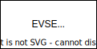
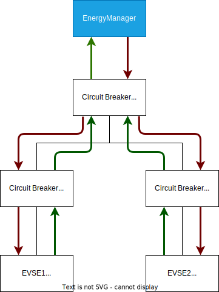

.. _everest_modules_handwritten_EnergyManager:

EnergyManager
=============

This module implements logic to distribute power to energy nodes based on
energy requests.
One of its central ideas is to represent the energy system for which power is
distributed as an energy tree containing energy nodes.
This enables the representation of arbitrarily complex configurations of
physical and logical components within the targeted energy system.

The following sections present this concept in more detail.

Energy nodes
------------

An energy node can be either a logical or physical component within the energy
system.

Energy nodes can typically be classified into the following categories:

* **Physical Components**: Circuit breakers, electrical fuses
* **Logical Components**: Limits from OCPP, EEBus, or other external sources
* **Charging Stations**: Unidirectional or bidirectional charging stations
  (or in general any sink or source of power)

An EVerest module becomes an energy node by implementing the
`energy <../interfaces/energy.yaml>`_ interface.

.. note::

    At the time of writing, two EVerest modules are considered energy nodes as
    per the above definition: **EnergyNode** and **EvseManager**.
    More may be added in the future.
    The **EnergyNode** module fulfills central aspects of the energy management
    concept.
    When the term **EnergyNode** is used, it refers to the actual module,
    whereas **energy node** refers to the general definition above.

The **EnergyNode** module both requires and provides the
`energy <../interfaces/energy.yaml>`_ interface.
This design enables the representation of arbitrary energy tree configurations
within the EVerest configuration file as explained in detail in a later
section.

Energy trees
------------

Energy trees are used to model various energy system configurations.
Below are examples demonstrating how energy systems can be represented in
EVerest.

The simplest energy tree consists of a single leaf node representing an EVSE
with a physical hardware capability of 32 A on 3 phases.

Typically, the electrical connection of charging stations is protected by a
circuit breaker.
Adding this to the representation results in:

.. image:: img/single_node_with_circuit_breaker.drawio.svg
    :name: single-node-with-circuit-breaker-label
    :align: center

In this example, the circuit breaker limits the current to 16 A, even though
the EVSE supports 32 A.
The module managing power distribution must enforce this limitation.

For a more complex setup, consider the following example:

.. image:: img/energy_tree.drawio.svg
    :name: energy-tree-label
    :align: center

Here, a top-level circuit breaker limits the line to 63 A.
Two additional circuit breakers protect the lines to two EVSEs, each fused at
32 A.
EVSE1 can consume 16 A on three phases, while EVSE2 can consume 32 A on three
phases.
This module accounts for all existing limitations when distributing power to
energy nodes.

All the scenarios above can be represented within EVerest.
The power distribution to the EVSEs is managed by this module, considering the
limitations of each individual node.
How these setups above can be represented in EVerest is presented in section
:ref:`configuration-of-energy-trees-in-everest`.

Energy requests and distribution
--------------------------------

The EnergyManager module requires exactly one module implementing the
`energy <../interfaces/energy.yaml>`_ interface.
This interface defines:

* A single variable **energy_flow_request** of type **EnergyFlowRequest**
* A single command **enforce_limits**

The concept of the usage of this interface is further described in the
following sections.

Energy flow request variable
^^^^^^^^^^^^^^^^^^^^^^^^^^^^

The **EnergyFlowRequest** type is recursive, containing a list of child
**EnergyFlowRequest**.
It defines the power and current requested by an energy node, along with its
limitations (e.g., hardware or software constraints).
In essence, a module specifies its requirements and limitations through this
type, which are then communicated to its parent node.
The parent node creates an aggregated **EnergyFlowRequest**, incorporating its
own limitations and the requests from its children.

Energy flow requests are constructed from the leaves to the root of the energy
tree, resulting in a single **EnergyFlowRequest** that contains all child
requests.
This final request serves as input for this module, which calculates the limits
to enforce down the tree.

The following diagram illustrates how energy nodes communicate requests, with
green arrows representing energy flow requests:

Enforcing limits
^^^^^^^^^^^^^^^^

The **enforce_limits** command propagates limits down the tree.
Each energy node calls this function on its child nodes to enforce calculated
limits.

Note that the EnergyManager itself does not represent an energy node.
It communicates the resulting **EnergyFlowRequest** to a single connected
energy node, which then propagates the limits further down the tree.

Details of the EnergyFlowRequest type
-------------------------------------

Energy nodes may have varying types of limits.
To understand this better, consider a zoomed-in view of an energy node:

.. image:: img/zoom_in_energy_node.drawio.svg
    :name: zoom-in-energy-node-label
    :align: center

In reality, an energy node may have different limits for charging (import) and
discharging (export).
The **EnergyFlowRequest** type accounts for this distinction:

* **Import**: Energy flow direction from the grid to the consumer/EV (charging)
* **Export**: Energy flow direction from the EV to the grid (discharging)

Additionally, each direction may have separate limits for the root and leaf
sides of the energy node.
For example, a DC power supply may have AC limits on the root side (facing the
grid) and DC limits on the leaf side (facing the EV).

Limits may also change over time, which is why the *schedule_import* and
*schedule_export* properties are lists containing multiple limit
specifications.

Below is an example JSON representation of an **EnergyFlowRequest** for a leaf node:

.. code-block:: json

    {
      "children": [],
      "evse_state": "Charging",
      "node_type": "Evse",
      "priority_request": false,
      "schedule_export": [
        {
          "limits_to_leaves": {
            "ac_max_current_A": 0.0
          },
          "limits_to_root": {
            "ac_max_current_A": 16.0,
            "ac_max_phase_count": 3,
            "ac_min_current_A": 0.0,
            "ac_min_phase_count": 1,
            "ac_number_of_active_phases": 3,
            "ac_supports_changing_phases_during_charging": true
          },
          "timestamp": "2024-12-17T13:08:36.479Z"
        }
      ],
      "schedule_import": [
        {
          "limits_to_leaves": {
            "ac_max_current_A": 32.0
          },
          "limits_to_root": {
            "ac_max_current_A": 32.0,
            "ac_max_phase_count": 3,
            "ac_min_current_A": 6.0,
            "ac_min_phase_count": 1,
            "ac_number_of_active_phases": 3,
            "ac_supports_changing_phases_during_charging": true
          },
          "timestamp": "2024-12-17T13:08:36.479Z"
        }
      ],
      "uuid": "evse1"
    }

External limits
---------------

External limits can be added to the energy system using EVerest modules
implementing the
`external_energy_limits <../interfaces/external_energy_limits.yaml>`_
interface.
At the time of writing, the **EnergyNode** module is the sole module that
provides this functionality.

The `external_energy_limits` interface defines the **set_external_limits**
command, which modules like OCPP or API can use to specify external energy
limits.
These limits are then considered by the **EnergyNode** module when creating
its energy flow request.

To apply external limits, a module must require the `external_energy_limits`
interface and invoke the **set_external_limits** command.
The next section details how to configure these limits in EVerest.

Configuration of energy trees in EVerest
----------------------------------------

The following section describes how to configure the EVerest configuration file
in order to represent the targeted energy tree.
In order to do that we are using a complex energy tree example and implement
this in the configuration step by step.

This is the energy tree that we are going to represent in the EVerest
configuration:

This energy tree represents a setup with two EVSEs.
There are two external sources that are able to provide external energy limits:
OCPP and the API module.

OCPP is able to set external limits for each EVSE as well as for the whole
charging station.
This is indicated by the three arrows labeled with OCPP.
The API module is only able to set the limits for the two EVSEs, but not for
the whole charging station.

.. note:: 

    To improve readability, unrelated module configurations and connections are
    omitted in the examples below.

First, we add two EvseManager modules to the config file representing our
energy leaf nodes.

.. code-block:: yaml
    
    active_modules:
        evse_manager_1:
            module: EvseManager
        evse_manager_2:
            module: EvseManager

The two EVSEs can receive limits from OCPP.
Therefore, we add two **EnergyNode** modules that represent the sinks for the
external limits.
The **EnergyNode** module requires a connection to a module implementing the
`energy <../interfaces/energy.yaml>`_ interface.
This is implemented by connecting the previously added EvseManager modules to it.

Any external limit applied to the added EnergyNode modules will be applied to
its energy child nodes (the EvseManager modules) now.

.. code-block:: yaml
    
    active_modules:
        evse_manager_1:
            module: EvseManager
        evse_manager_2:
            module: EvseManager
        ocpp_sink_1:
            module: EnergyNode
            connections:
                energy_consumer:
                - module_id: evse_manager_1
                  implementation_id: energy_grid
        ocpp_sink_2:
            module: EnergyNode
            connections:
                energy_consumer:
                - module_id: evse_manager_2
                  implementation_id: energy_grid

We continue with adding **EnergyNode** modules that represent the sinks for the
limits received by the API module.
Note that the **EnergyNode** module provides and requires the
`energy <../interfaces/energy.yaml>`_ interface at the same time.
This allows us to connect **EnergyNode** modules and therefore fullfill the
requirement of others.

Note that the modules **ocpp_sink_1** and **ocpp_sink_2** are connected to the
**api_sink_1** and **api_sink_2**.
This means that both limits can be considered by this module without
overriding each other.

.. code-block:: yaml
    
    active_modules:
        evse_manager_1:
            module: EvseManager
        evse_manager_2:
            module: EvseManager
        ocpp_sink_1:
            module: EnergyNode
            connections:
                energy_consumer:
                - module_id: evse_manager_1
                  implementation_id: energy_grid
        ocpp_sink_2:
            module: EnergyNode
            connections:
                energy_consumer:
                - module_id: evse_manager_2
                  implementation_id: energy_grid
        api_sink_1:
            module: EnergyNode
            connections:
                energy_consumer:
                  - module_id: ocpp_sink_1
                    implementation_id: energy_grid
        api_sink_2:
            module: EnergyNode
            connections:
                energy_consumer:
                  - module_id: ocpp_sink_2
                    implementation_id: energy_grid

We are now only missing a represention for the complete charging station.
Therefore, we add another **EnergyNode** module with a fuse limit of 63 A and
we name it **grid_connection_point**.
We connect **api_sink_1** and **api_sink_2** to it.

.. code-block:: yaml
    
    active_modules:
        evse_manager_1:
            module: EvseManager
        evse_manager_2:
            module: EvseManager
        ocpp_sink_1:
            module: EnergyNode
            connections:
                energy_consumer:
                - module_id: evse_manager_1
                  implementation_id: energy_grid
        ocpp_sink_2:
            module: EnergyNode
            connections:
                energy_consumer:
                - module_id: evse_manager_2
                  implementation_id: energy_grid
        api_sink_1:
            module: EnergyNode
            connections:
                energy_consumer:
                  - module_id: ocpp_sink_1
                    implementation_id: energy_grid
        api_sink_2:
            module: EnergyNode
            connections:
                energy_consumer:
                  - module_id: ocpp_sink_2
                    implementation_id: energy_grid
        grid_connection_point:
            module: EnergyNode
            config_module:
                fuse_limit_A: 63
                phase_count: 3
            connections:
                energy_consumer:
                  - module_id: api_sink_1
                    implementation_id: energy_grid
                  - module_id: api_sink_2
                    implementation_id: energy_grid
        

Now we have the complete energy tree represented, but we're still missing to
include the modules that set the external energy limits, so the OCPP and API
module.
Since these modules require (optionally multiple) connections to modules
implementing the
`external_energy_limits <../interfaces/external_energy_limits.yaml>`_
interface, we need to also add the connections to the **EnergyNode** modules we
have added previously.
Finally, we also add the **EnergyManager** module and connect the
**grid_connection_point** to it.

.. code-block:: yaml
    
    active_modules:
        evse_manager_1:
            module: EvseManager
        evse_manager_2:
            module: EvseManager
        ocpp_sink_1:
            module: EnergyNode
            connections:
                energy_consumer:
                - module_id: evse_manager_1
                  implementation_id: energy_grid
        ocpp_sink_2:
            module: EnergyNode
            connections:
                energy_consumer:
                - module_id: evse_manager_2
                  implementation_id: energy_grid
        api_sink_1:
            module: EnergyNode
            connections:
                energy_consumer:
                  - module_id: ocpp_sink_1
                    implementation_id: energy_grid
        api_sink_2:
            module: EnergyNode
            connections:
                energy_consumer:
                  - module_id: ocpp_sink_2
                    implementation_id: energy_grid
        grid_connection_point:
            module: EnergyNode
            config_module:
                fuse_limit_A: 63
                phase_count: 3
            connections:
                energy_consumer:
                  - module_id: api_sink_1
                    implementation_id: energy_grid
                  - module_id: api_sink_2
                    implementation_id: energy_grid
        ocpp:
            module: OCPP
            connections:
                evse_energy_sink:
                  - module_id: grid_connection_point
                    implementation_id: external_limits
                  - module_id: ocpp_sink_1
                    implementation_id: external_limits
                  - module_id: ocpp_sink_2
                    implementation_id: external_limits
        api:
            module: API
            connections:
                evse_energy_sink:
                  - module_id: api_sink_1
                    implementation_id: external_limits
                  - module_id: api_sink_2
                    implementation_id: external_limits
        energy_manager:
            module: EnergyManager
            connections:
                energy_trunk:
                  - module_id: grid_connection_point
                    implementation_id: energy_grid

We have now added all the required modules and connections to represent the
energy tree example of :ref:`energy-tree-complex-label`.
One important detail is still missing, which is the module mapping.
For detailed information about the module mapping please see 
`3-tier module mappings <https://everest.github.io/nightly/general/05_existing_modules.html#tier-module-mappings>`_.

Since the connections of a module in the EVerest config does not automatically
map to a specific EVSE (or the whole charging station, represented by EVSE#0),
the **EnergyNode** modules must have a module mapping.
This allows the modules that make use of the **set_external_limits** command to
call it for the correct node.

Modules like OCPP and API can only know at which requirement the command
**set_external_limit** shall be called in case the energy node that is
connected to it has a specified module mapping in the EVerest config.

This is a full example including the module mappings:

.. code-block:: yaml
    
    active_modules:
        evse_manager_1:
            module: EvseManager
            mapping:
                module:
                    evse: 1
        evse_manager_2:
            module: EvseManager
            mapping:
                module:
                    evse: 2
        ocpp_sink_1:
            module: EnergyNode
            mapping:
                module:
                    evse: 1
            connections:
                energy_consumer:
                - module_id: evse_manager_1
                  implementation_id: energy_grid
        ocpp_sink_2:
            module: EnergyNode
            mapping:
                module:
                    evse: 2
            connections:
                energy_consumer:
                - module_id: evse_manager_2
                  implementation_id: energy_grid
        api_sink_1:
            module: EnergyNode
            mapping:
                module:
                    evse: 1
            connections:
                energy_consumer:
                  - module_id: ocpp_sink_1
                    implementation_id: energy_grid
        api_sink_2:
            module: EnergyNode
            mapping:
                module:
                    evse: 2
            connections:
                energy_consumer:
                  - module_id: ocpp_sink_2
                    implementation_id: energy_grid
        grid_connection_point:
            module: EnergyNode
            mapping:
                module:
                    evse: 0
            config_module:
                fuse_limit_A: 63
                phase_count: 3
            connections:
                energy_consumer:
                  - module_id: api_sink_1
                    implementation_id: energy_grid
                  - module_id: api_sink_2
                    implementation_id: energy_grid
        ocpp:
            module: OCPP
            connections:
                evse_energy_sink:
                  - module_id: grid_connection_point
                    implementation_id: external_limits
                  - module_id: ocpp_sink_1
                    implementation_id: external_limits
                  - module_id: ocpp_sink_2
                    implementation_id: external_limits
        api:
            module: API
            connections:
                evse_energy_sink:
                  - module_id: api_sink_1
                    implementation_id: external_limits
                  - module_id: api_sink_2
                    implementation_id: external_limits
        energy_manager:
            module: EnergyManager
            connections:
                energy_trunk:
                  - module_id: grid_connection_point
                    implementation_id: energy_grid

Energy distribution
-------------------

The EnergyManager module implements an algorithm to distribute available power
to energy leaf nodes:

* It calculates and enforces limits for each energy leaf node in the tree.
* It ensures that no node exceeds its specified limits for current, power, or
  phase count.
* It distributes power equally among child nodes, if their collective request
  exceeds the parent node's limits.
* The algorithm prefers charging over discharging if the specified limits allow
  for both.
* It supports phase switching between single-phase and three-phase modes,
  optimizing power usage for low-demand scenarios if
  **switch_3ph1ph_while_charging_mode** is enabled.

Phase switching
===============

This module supports switching between single-phase (1ph) and three-phase (3ph)
configurations during AC charging.

.. warning::

   Some vehicles (such as the first generation of Renault Zoe) may be
   permanently damaged when switching from 1ph to 3ph during charging.
   Use at your own risk!

To use this feature, several configurations must be enabled across different
EVerest modules:

- **EvseManager**: Adjust the following configuration options to your needs:
  - ``switch_3ph1ph_delay_s``
  - ``switch_3ph1ph_cp_state``
- **Module implementing the `evse_board_support <../interfaces/evse_board_support.yaml>`_ interface:**
  - Set ``supports_changing_phases_during_charging`` to ``true`` in the reported capabilities.
  - Define the minimum number of phases as 1 and the maximum as 3.
  - Ensure the ``ac_switch_three_phases_while_charging`` command is implemented.
- **EnergyManager**: Adjust the following config options to your needs:
  - switch_3ph1ph_while_charging_mode
  - switch_3ph1ph_max_nr_of_switches_per_session
  - switch_3ph1ph_switch_limit_stickyness
  - switch_3ph1ph_power_hysteresis_W
  - switch_3ph1ph_time_hysteresis_s

Refer to the manifest.yaml for documentation of these configuration options.

If all of these are properly configured, the EnergyManager will handle the
1ph/3ph switching.
To enable this, an external limit must be set.
There are two ways to configure the limit:

1. **Watt-based limit (preferred option):** The limit is set in Watts (not
  Amperes), even though this involves AC charging.
  This provides the EnergyManager with the flexibility to decide when to
  switch.
  The limit can be defined by an OCPP schedule or through an additional
  EnergyNode.
2. **Ampere-based limit:** The limit is defined in Amperes, along with a
  restriction on the number of phases (e.g., ``min_phase=1`` and
  ``max_phase=1``).
  This enforces switching and allows external control over the switching time,
  but the EnergyManager loses its ability to choose when to switch.

Best practices
^^^^^^^^^^^^^^

In general, this feature works best in a configuration with 32 A per phase and
a Watt-based limit.
In this setup, there is an overlap between the single phase and three phase
domain:

- Single-phase charging: 1.3 kW to 7.4 kW
- Three-phase charging: 4.2 kW to 22 kW (or 11 kW)

This avoids switching too often in the most elegant way.
Other methods to reduce the number of switch cycles can be configured in the
EnergyManager, see config options above.

Current limitations
-------------------

* The algorithm does not account for real-time power meter readings from
  individual nodes.
* It does not redistribute unused power when the actual consumption is below
  the assigned target value.

