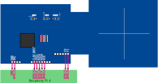

# nxpnfcrdlib_wrapper

This library provides elementary RFID functionality using NXP's Nfc Reader Library for Nfc frontend chips.
These so called frontend chips require tight control from the host controller in order to execute standard conforming NFC communication.
The proprietary `NXP Nfc Reader Library` is therefore used.
It underlies an EULA and therefore not be shipped with `EVerest`.
It needs to be configured at compile-time to match the target device (both Linux host and interfaced NFC chip).

## Folder Structure

```
nxpnfcrdlib_wrapper
├── doc
├── inc
├── lib/customization
├── src
├── testApplication
├── CMakeLists.txt
└── README.md
```

- `doc`: Documentation (graphics)
- `inc`: Public include file required be users of ``nxpnfcrdlib_wrapper``
- `lib/customization`: Build scripts and suplemental C code for a customized build of the `NXP Nfc Reader Library` within `EVerest`
- `src`: C++ code of this module
- `testApplication`: Minimal application which shows how to use ``nxpnfcrdlib_wrapper``
- `CMakeLists.txt`: Build file
- `README.MD`: This file

## Use

At this time this code only works for **RC663** NFC Frontend Chips.
It could be extended to support different chips (**PN51[8,9]0**).

### Building

1. Setup environment for everest-core as usual
2. Get **NxpNfcRdLib_Linux_v07.10.00_PUB.zip** from [nxp.com](https://www.nxp.com/design/design-center/development-boards-and-designs/nfc-reader-library-software-support-for-nfc-frontend-solutions:NFC-READER-LIBRARY)
3. Store zip file at arbitrary location
4. Provide this location to your EVerest build at configuration time: ``-DEXTERNAL_NXPNFCRDLIB_ZIP_PATH_NxpNfcFrontendTokenProvider=/<path>/<to>/<your>/NxpNfcRdLib_Linux_v07.10.00_PUB.zip``
5. everest-core will automatically choose to include these sources into the build of the ``NxpNfcFrontendTokenProvider``

### Example

```
git clone git@github.com:EVerest/everest-core.git
# download NxpNfcRdLib_Linux_v07.10.00_PUB.zip
mkdir build
cmake -S everest-core -B build -DEXTERNAL_NXPNFCRDLIB_ZIP_PATH_NxpNfcFrontendTokenProvider=/<path>/<to>/<your>/NxpNfcRdLib_Linux_v07.10.00_PUB.zip
cmake --build build --parallel -j
cmake --install build/
```

The use with different boards/chips requires customization **before** compilation (see below)!

## Customization

The code delivered by NXP implements SPI interfaced chips only.
As an example GPIO access has been implemented by NXP with userspace code for the Raspberry Pi 3.

Adaptions to different Linux boards can be done by adding files to ```lib/customization/```.

While ```RTOS/phOsal``` (OS abstraction layer) can usually be left as is, ```Platform/DAL``` (Device abstraction layer) will most likely need additional code.

### Example Raspberry Pi 4

As a minmal adaption example, this repository contains a customization for Raspberry Pi 4.

A new ```Platform/DAL/cfg/BoardSelection.h``` has been provided, in order to choose a different board specific header file (```Platform/DAL/boards/Board_Pi4Rc663.h```).
The latter contains a changed GPIO pinount (compared to the Raspberry Pi 3).

Function wrappers (to provide neutral naming) and convenience functions are provided in ```Platform/DAL/src/rpi4_gpio.c```.
They call functions from the original ```external/Platform/DAL/src/Linux/phDriver_Linux_Int.c```.

### General

* Provide new device-specific (=fitting the individual board/chip combination) ```Platform/DAL/boards/Board_xyz.h```.
* Allow it to be chosen in ```Platform/DAL/cfg/BoardSelection.h```
* Change compile definition in ```Platform/DAL/CMakeLists.txt``` from the given ```PHDRIVER_PI4RC663_BOARD``` to the one required by the modified ```BoardSelection.h```
* If required, add c-files in ```Platform/DAL/src``` which implement hardware access differently, i.e. access to GPIOs, SPI/I²C. Use ```lib/external/Platform/DAL/src/Linux/*.c``` as templates.
  * Register access (via I²C or SPI) requires implementation of (cmp. ```external/Platform/DAL/inc/phbalReg.h```):
    * ```phStatus_t phbalReg_Init(...)```
    * ```phStatus_t phbalReg_Exchange(...)```
    * ```phStatus_t phbalReg_SetConfig(...)```
    * ```phStatus_t phbalReg_GetConfig(...)```
  * GPIO access requires implementation of (cmp. ```external/Platform/DAL/inc/phDriver_Gpio.h```):
    * ```phStatus_t phDriver_PinConfig(...)```
    * ```uint8_t phDriver_PinRead(...)```
    * ```phStatus_t phDriver_IRQPinRead(...)```
    * ```phStatus_t phDriver_IRQPinPoll(...)```
    * ```void phDriver_PinWrite(...)```
    * ```void phDriver_PinClearIntStatus(...)```
  * GPIO access also requires implementation of (cmp. ```Platform/DAL/boards/Board_Pi4Rc663.h```) - these can be implemented based on existing functions like in ```external/Platform/DAL/src/Linux/phDriver_Linux_Int.c``` or from scratch:
    * ```void GPIO_reconfigure_pin(size_t gpio, int output_int)```
    * ```phStatus_t GPIO_read_pin(size_t gpio, uint8_t *pGpioVal)```
    * ```phStatus_t GPIO_poll_pin(size_t gpio, int timeOutms)```
* Change ```Platform/DAL/CMakeLists.txt``` in order to include the customized files in the build, in addition and/or instead of the ones provided by NXP

## Example Hardware Setup

The NxpNfcFrontendLib has been tested with a *Raspberry Pi 4* (SPI needs to be activated) and the [CLEV6630B](https://www.nxp.com/part/CLEV6630B) development board.
The *CLEV6630B* was powered from the Raspberry Pi via USB (jumpers need to be set accordingly: "USB", "VDD: +3.3V", "TVDD: +5V"); the onboard LPC microcontroller has beed detached from the NFC chip (solder bridges removed).

There are 9 electrical connections to the Raspberry Pi required:

| CLEV6630B Pin | Raspberry Pi Pin  |
|:--------------|:------------------|
| MOSI          | SPI-MOSI (GPIO 10)|
| MISO          | SPI-MISO (GPIO 9) |
| SCK           | SPI-CLK (GPIO 11) |
| SSEL          | SPI-CE0 (GPIO 8)  |
| CLRC_NRST     | GPIO 24           |
| IRQ           | GPIO 23           |
| IFSEL0 (F0)   | GPIO 27           |
| IFSEL1 (F1)   | GPIO 22           |
| GND           | GND               |


