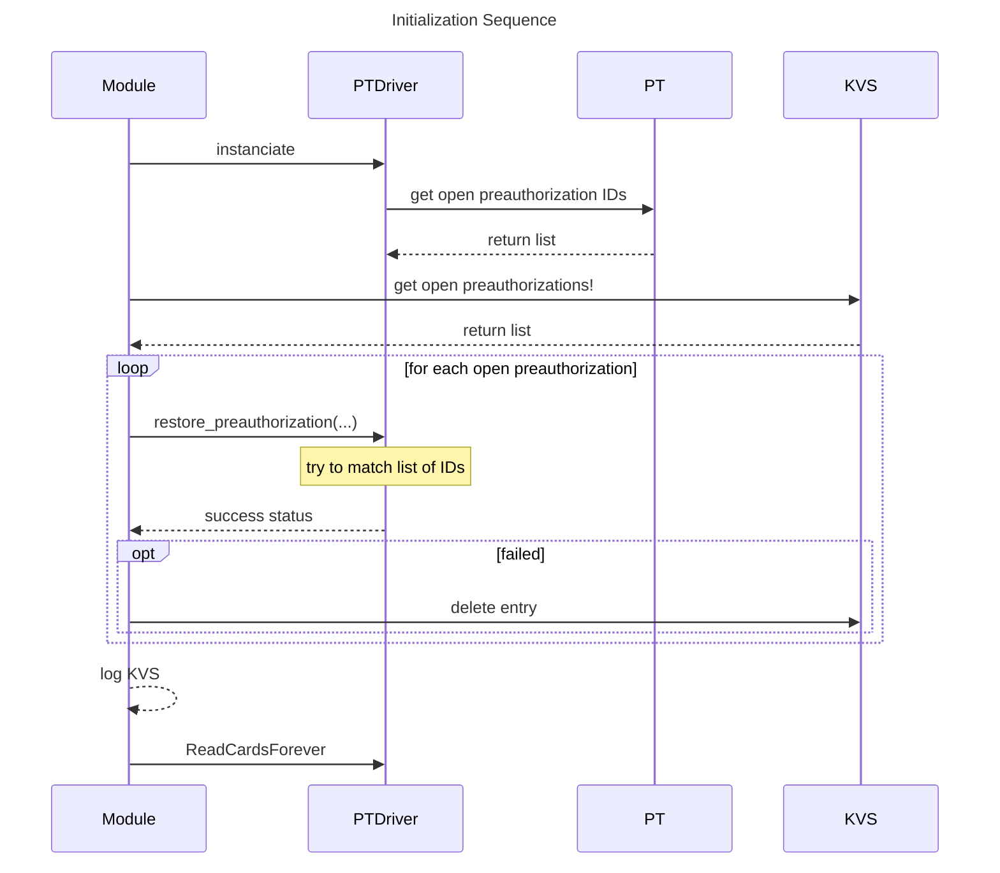

# Payment Terminal Module Boot Sequence

Does not include Terminal initialization and failures.

```mermaid
sequenceDiagram
participant Module
participant PTDriver
participant PT
participant KVS

title Initialization Sequence
    Module->>PTDriver: instanciate
    PTDriver->>PT: get open preauthorization IDs
    PT-->>PTDriver: return list
    Module->>KVS: get open preauthorizations!
    KVS-->>Module: return list
    loop for each open preauthorization
        Module->>PTDriver: restore_preauthorization(...)
        Note over PTDriver: try to match list of IDs
        PTDriver-->>Module: success status
        opt failed
            Module->>KVS: delete entry
        end
    end
    Module-->>Module: log KVS
    Module->>PTDriver: ReadCardsForever
```
