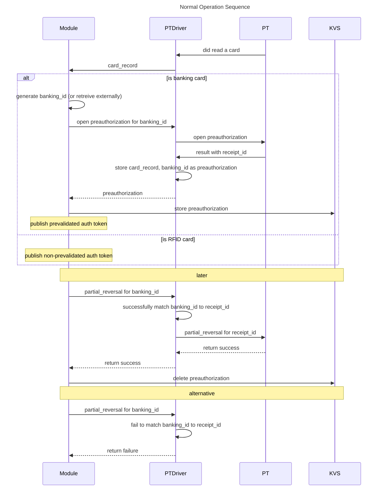

# Payment Terminal Module Boot Sequence

Does not include Terminal failures and other errors.

```mermaid
sequenceDiagram
participant Module
participant PTDriver
participant PT
participant KVS

title Initialization Sequenceto match list of IDssequenceDiagram
participant Module
participant PTDriver
participant PT
participant KVS

title Normal Operation Sequence

    PT->>PTDriver: did read a card
    PTDriver->>Module: card_record
    alt is banking card
        Module->>Module: generate banking_id (or retreive externally)
        Module->>PTDriver: open preauthorization for banking_id
        PTDriver->>PT: open preauthorization
        PT->>PTDriver: result with receipt_id
        PTDriver->>PTDriver: store card_record, banking_id as preauthorization
        PTDriver-->>Module: preauthorization
        Module->>KVS: store preauthorization
        Note over Module: publish prevalidated auth token
    else is RFID card
        Note over Module: publish non-prevalidated auth token
    end

    Note over Module,KVS: later

    Module->>PTDriver: partial_reversal for banking_id
    PTDriver->>PTDriver: successfully match banking_id to receipt_id
    PTDriver->>PT: partial_reversal for receipt_id
    PT-->>PTDriver: return success
    PTDriver-->>Module: return success
    Module->>KVS: delete preauthorization

    Note over Module,KVS: alternative

    Module->>PTDriver: partial_reversal for banking_id
    PTDriver->>PTDriver: fail to match banking_id to receipt_id
    PTDriver-->>Module: return failure
```
